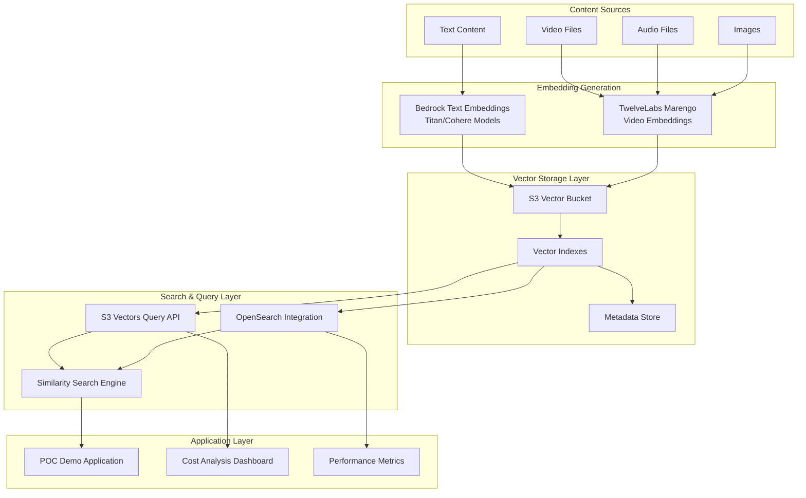
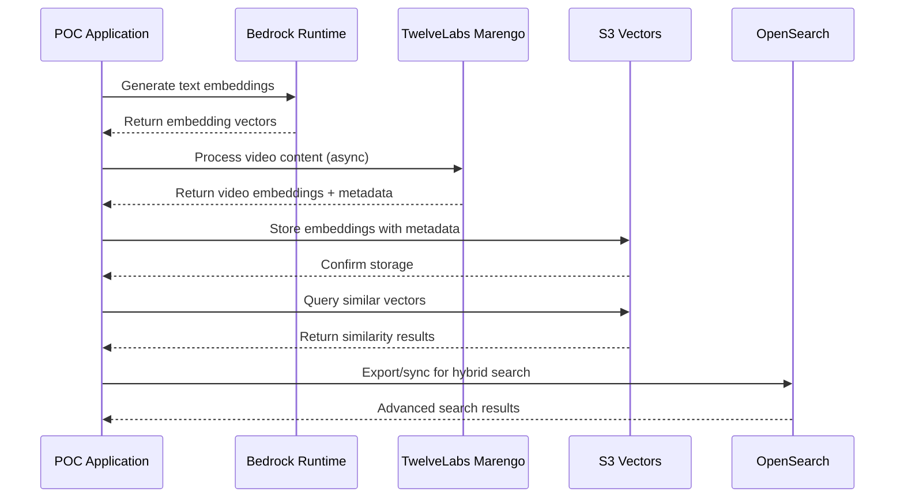

# Design Document

## Overview

This POC demonstrates a comprehensive vector embedding pipeline using AWS S3 Vectors as the storage layer, Amazon Bedrock for text embeddings, and TwelveLabs Marengo model for video embeddings. The system showcases cost-effective vector storage with sub-second query performance, integration with OpenSearch for advanced search capabilities, and practical use cases for media companies like Netflix.

The architecture emphasizes scalability, cost optimization, and enterprise-grade security while providing a complete end-to-end demonstration from content ingestion to similarity search across multiple modalities (text, video, audio, images).

## Architecture

### High-Level Architecture



### Component Integration Flow



## Components and Interfaces

### 1. S3 Vector Storage Manager

**Purpose**: Manages S3 vector bucket creation, index management, and vector operations.

**Key Interfaces**:
- `create_vector_bucket(bucket_name, region)`: Creates S3 vector bucket
- `create_vector_index(bucket_name, index_name, dimensions)`: Creates vector index
- `put_vectors(index_arn, vectors_data)`: Stores vectors with metadata
- `query_vectors(index_arn, query_vector, top_k, filters)`: Performs similarity search
- `list_vectors(index_arn, pagination_token)`: Lists stored vectors

**Implementation Details**:
- Uses `s3vectors` boto3 client with proper IAM permissions
- Supports batch vector operations for efficiency
- Implements retry logic for transient failures
- Handles vector dimensionality validation

### 2. Bedrock Embedding Service

**Purpose**: Generates text embeddings using Amazon Bedrock foundation models.

**Key Interfaces**:
- `generate_text_embedding(text, model_id)`: Single text embedding
- `batch_generate_embeddings(texts, model_id)`: Batch processing
- `get_supported_models()`: Lists available embedding models
- `validate_model_access(model_id)`: Checks model permissions

**Supported Models**:
- `amazon.titan-embed-text-v2:0`: 1024 dimensions, multilingual
- `amazon.titan-embed-image-v1`: 1024 dimensions, multimodal
- `cohere.embed-english-v3`: 1024 dimensions, English optimized
- `cohere.embed-multilingual-v3`: 1024 dimensions, multilingual

**Implementation Details**:
- Uses `bedrock-runtime` client with InvokeModel API
- Implements proper error handling for model access issues
- Supports configurable inference parameters
- Handles rate limiting and throttling

### 3. TwelveLabs Video Processing Service

**Purpose**: Processes video content using TwelveLabs Marengo model for multimodal embeddings.

**Key Interfaces**:
- `process_video_async(video_uri, embedding_options)`: Async video processing
- `check_processing_status(job_id)`: Monitor async job status
- `retrieve_video_embeddings(output_s3_uri)`: Get processed results
- `process_video_segments(video_uri, segment_duration)`: Process video in chunks

**Model Configuration**:
- Model ID: `twelvelabs.marengo-embed-2-7-v1:0`
- Supported inputs: Video (S3 URI or base64), Text, Audio, Images
- Embedding options: `visual-text`, `visual-image`, `audio`
- Max video size: 2 hours, <2GB file size

**Implementation Details**:
- Uses StartAsyncInvoke API for video processing
- Supports configurable segment duration (2-10 seconds)
- Handles S3 output delivery and parsing
- Implements temporal metadata extraction (startSec, endSec)

### 4. OpenSearch Integration Manager

**Purpose**: Manages integration between S3 Vectors and OpenSearch for advanced search capabilities.

**Key Interfaces**:
- `export_to_opensearch_serverless(index_arn, collection_name)`: Export data
- `configure_s3_vectors_engine(domain_name, index_config)`: Set up engine integration
- `perform_hybrid_search(query_text, vector_query, filters)`: Combined search
- `monitor_integration_costs(integration_type)`: Cost tracking

**Integration Patterns**:
1. **Export Pattern**: Point-in-time export to OpenSearch Serverless
   - High query throughput, low latency
   - Advanced analytics and aggregations
   - Higher cost due to dual storage

2. **Engine Pattern**: S3 Vectors as OpenSearch storage engine
   - Cost-optimized storage
   - Lower query throughput
   - Maintains OpenSearch functionality

### 5. Similarity Search Engine

**Purpose**: Orchestrates similarity searches across different content types and modalities.

**Key Interfaces**:
- `find_similar_content(query_vector, content_type, top_k)`: Cross-modal search
- `search_by_text_query(query_text, target_modalities)`: Natural language search
- `search_video_scenes(video_query, time_range)`: Temporal video search
- `filter_by_metadata(base_results, metadata_filters)`: Result filtering

**Search Capabilities**:
- Text-to-text similarity
- Text-to-video scene matching
- Video-to-video similarity
- Cross-modal search (text query → video results)
- Temporal search within video content

## Data Models

### Vector Data Model

```python
@dataclass
class VectorData:
    key: str                    # Unique identifier
    embedding: List[float]      # Vector embedding (1024 dimensions)
    metadata: Dict[str, Any]    # Filterable metadata
    content_type: str          # text, video, audio, image
    source_uri: Optional[str]   # Original content location
    created_at: datetime       # Timestamp
    
    # Video-specific fields
    start_sec: Optional[float]  # Segment start time
    end_sec: Optional[float]    # Segment end time
    embedding_option: Optional[str]  # visual-text, visual-image, audio
```

### Metadata Schema

```python
@dataclass
class ContentMetadata:
    # Common fields
    title: str
    description: str
    tags: List[str]
    category: str
    language: str
    
    # Media-specific fields
    duration: Optional[float]   # For video/audio
    resolution: Optional[str]   # For video/images
    file_size: int
    format: str
    
    # Business fields
    content_id: str
    series_id: Optional[str]
    season: Optional[int]
    episode: Optional[int]
    genre: List[str]
    actors: List[str]
    director: Optional[str]
    release_date: date
    
    # Processing fields
    processing_status: str
    quality_score: Optional[float]
    confidence_score: Optional[float]
```

### Search Result Model

```python
@dataclass
class SearchResult:
    vector_key: str
    similarity_score: float
    content_metadata: ContentMetadata
    embedding_info: Dict[str, Any]
    temporal_info: Optional[Dict[str, float]]  # For video segments
    
@dataclass
class SearchResponse:
    query_id: str
    results: List[SearchResult]
    total_results: int
    search_time_ms: int
    cost_estimate: float
```

## Error Handling

### Error Categories and Strategies

1. **Model Access Errors**
   - Retry with exponential backoff
   - Fallback to alternative models
   - Clear error messages for access requests

2. **Vector Storage Errors**
   - Validate vector dimensions before storage
   - Handle S3 service limits gracefully
   - Implement batch operation error recovery

3. **Async Processing Errors**
   - Monitor job status with timeout handling
   - Implement dead letter queues for failed jobs
   - Provide clear status updates to users

4. **Integration Errors**
   - Validate OpenSearch connectivity
   - Handle export failures with partial recovery
   - Monitor integration health continuously

### Error Response Format

```python
@dataclass
class ErrorResponse:
    error_code: str
    error_message: str
    error_details: Dict[str, Any]
    retry_after: Optional[int]
    suggested_action: str
```

## Testing Strategy

### Unit Testing
- Mock AWS service calls using moto/boto3 stubs
- Test vector dimension validation
- Test metadata filtering logic
- Test error handling scenarios

### Integration Testing
- Test with real AWS services in development environment
- Validate S3 Vectors API operations
- Test Bedrock model access and embedding generation
- Test TwelveLabs async processing workflow

### Performance Testing
- Measure embedding generation latency
- Test vector storage and query performance
- Benchmark similarity search response times
- Load test with realistic data volumes

### Cost Testing
- Monitor actual AWS service costs during testing
- Compare S3 Vectors vs traditional vector database costs
- Measure OpenSearch integration cost implications
- Validate cost optimization strategies

### End-to-End Testing Scenarios

1. **Content Discovery Scenario**
   - Upload sample video content
   - Generate embeddings using TwelveLabs
   - Store in S3 Vectors with metadata
   - Perform natural language search
   - Validate results and performance

2. **Batch Processing Scenario**
   - Process multiple videos simultaneously
   - Handle async job management
   - Validate temporal segmentation
   - Test error recovery mechanisms

3. **Cross-Modal Search Scenario**
   - Search video content using text queries
   - Find similar scenes across different videos
   - Test metadata filtering capabilities
   - Validate search result relevance

4. **OpenSearch Integration Scenario**
   - Export vectors to OpenSearch Serverless
   - Configure S3 Vectors engine integration
   - Test hybrid search capabilities
   - Compare performance and costs

### Test Data Requirements

- Sample video files (various formats, durations)
- Text content with different languages and domains
- Metadata examples representing realistic media catalogs
- Performance benchmarking datasets
- Cost analysis scenarios with different usage patterns