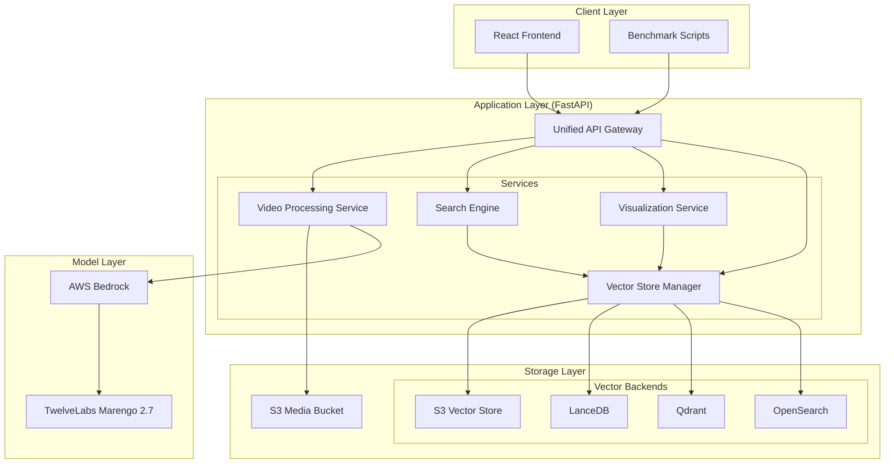
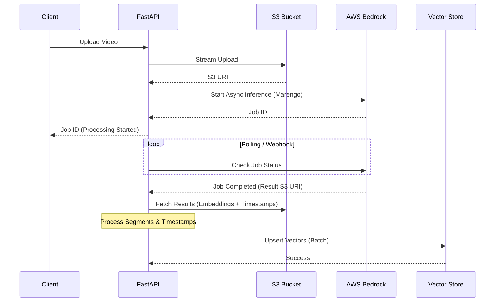

# VideoLake System Architecture

## 1. System Overview

VideoLake is a unified multi-modal video search and analytics platform designed to run on a single powerful EC2 instance (`videolake_platform`). It serves two primary purposes:
1.  **User Interface**: A React-based frontend for users to upload videos, search content using natural language, and visualize embedding spaces.
2.  **Headless Benchmark API**: A robust API for running automated benchmarks to compare different vector storage backends (S3Vector, LanceDB, Qdrant, OpenSearch) and embedding models.

The system leverages a modular "Provider" pattern for vector storage, allowing dynamic switching between backends without changing the core application logic.

## 2. Component Architecture

The system follows a layered architecture:



### Key Components
*   **Unified API Gateway**: FastAPI application serving REST endpoints for both UI and Benchmarks.
*   **Vector Store Manager**: Implements the Strategy pattern to manage connections to different vector backends dynamically.
*   **Video Processing Service**: Handles video uploads, interacts with AWS Bedrock to invoke TwelveLabs Marengo models, and processes async job results.
*   **Visualization Service**: Performs dimensionality reduction (PCA, t-SNE, UMAP) on high-dimensional embeddings for 2D/3D visualization.

## 3. Data Models

### 3.1 Video Asset
Represents a video file stored in S3.
```json
{
  "video_id": "uuid-string",
  "title": "Video Title",
  "s3_uri": "s3://bucket/path/video.mp4",
  "metadata": {
    "duration": 120.5,
    "format": "mp4",
    "file_size": 10485760
  },
  "processing_status": "completed"
}
```

### 3.2 Embedding Segment
Represents a specific segment of a video with its vector representation.
```json
{
  "id": "segment-uuid",
  "vector": [0.12, -0.45, ...],  // 1024d for Marengo
  "vector_type": "visual-text",   // or "visual-image", "audio"
  "metadata": {
    "video_id": "uuid-string",
    "start_sec": 10.0,
    "end_sec": 15.0,
    "text_content": "Optional text description if available"
  }
}
```

### 3.3 Search Result
Standardized response format across all backends.
```json
{
  "id": "segment-uuid",
  "score": 0.89,
  "metadata": {
    "video_id": "uuid-string",
    "start_sec": 10.0,
    "end_sec": 15.0
  },
  "vector_type": "visual-text",
  "backend_source": "lancedb"
}
```

## 4. Ingestion Workflow

The ingestion process is asynchronous to handle large video files and model processing times.



## 5. Marengo Timestamp Strategy

TwelveLabs Marengo is a "chunk-less" model, meaning it understands the video holistically. However, for search applications, we need to map embeddings back to specific timestamps.

**Strategy:**
1.  **Fixed-Interval Segmentation**: We configure the Marengo API to output embeddings at fixed intervals (e.g., every 5 seconds) using the `useFixedLengthSec` parameter.
2.  **Result Parsing**: The API returns a list of segments. We extract:
    *   `start_offset_sec`: The start time of the segment.
    *   `end_offset_sec`: The end time of the segment.
    *   `embedding`: The vector representation.
3.  **Storage**: These timestamps are stored as **metadata** alongside the vector in the chosen backend (LanceDB, Qdrant, etc.).
4.  **Retrieval**: When a search hit occurs, the backend returns the metadata, allowing the UI to seek the video player to `start_offset_sec`.

**Handling "Global" Embeddings:**
If `useFixedLengthSec` is not used, Marengo provides a single embedding for the whole video. In this case, `start_sec` is 0 and `end_sec` is the video duration.

## 6. Dynamic Backend Management

The `VectorStoreManager` allows switching backends at runtime.

*   **Configuration**: Backends are configured via environment variables or API payload.
*   **Unified Interface**: All backends implement the `VectorStoreProvider` abstract base class:
    *   `upsert_vectors(name, vectors)`
    *   `query(name, query_vector, top_k)`
    *   `delete(name)`
*   **Benchmark Mode**: The benchmark script iterates through available providers, running the same dataset and queries against each, collecting metrics (latency, recall, cost).
*   **UI Mode**: The UI typically queries a primary backend (e.g., LanceDB) but can be toggled to "Compare Mode" to show results from multiple backends side-by-side.

## 7. Visualization Data Flow

To visualize the high-dimensional embedding space:

1.  **Data Fetch**: The frontend requests a visualization for a specific index/dataset.
2.  **Backend Processing**:
    *   The `SemanticMappingVisualizer` service fetches a subset of vectors (e.g., random sample + query vector + top results).
    *   It applies dimensionality reduction (PCA, t-SNE, or UMAP) to reduce vectors to 2D or 3D points.
3.  **Response**: The API returns a JSON object containing `x`, `y`, `z` coordinates and metadata for each point.
4.  **Rendering**: The React frontend uses a library like `plotly.js` or `three.js` to render the interactive scatter plot.

```mermaid
graph LR
    VectorStore[Vector Store] -->|Raw Vectors| Visualizer[Visualization Service]
    Visualizer -->|Dimensionality Reduction| API[API Response]
    API -->|JSON Points| Frontend[React UI]
    Frontend -->|Render| Plot[Interactive Plot]