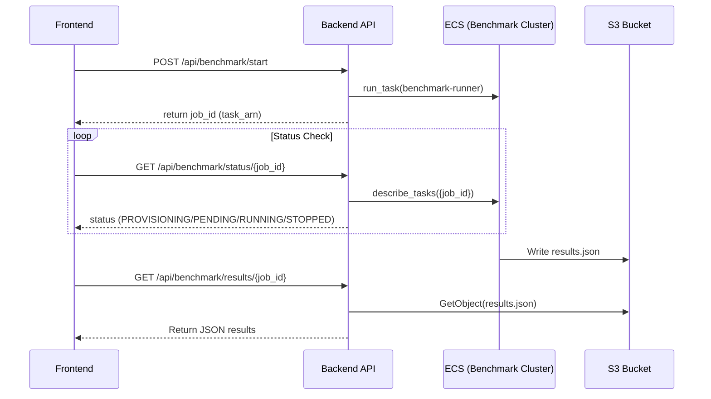

# VideoLake Enhancement Plan

This document outlines the technical plan to address user feedback regarding Benchmarking, Ingestion, and Dataset management.

## 1. ECS Benchmarking Trigger

**Goal:** Enable triggering the isolated ECS benchmark task directly from the UI via the API, rather than running benchmarks locally within the API container.

### Current State
- **Infrastructure:** `terraform/modules/benchmark_runner_ecs` deploys a dedicated ECS Cluster and Task Definition (`videolake-benchmark-runner`).
- **API:** `src/api/routers/benchmark.py` calls `BenchmarkService.start_benchmark`.
- **Service:** `src/backend/benchmark_service.py` runs benchmarks locally using `ThreadPoolExecutor`.

### Implementation Plan

1.  **Update IAM Permissions (`terraform/modules/videolake_backend_ecs/main.tf`)**
    *   Grant the Backend API Task Role permissions to run ECS tasks.
    *   Required Actions: `ecs:RunTask`, `iam:PassRole` (for the benchmark task execution role).
    *   Resource: ARN of the benchmark task definition.

2.  **Modify `BenchmarkService` (`src/backend/benchmark_service.py`)**
    *   Replace `ThreadPoolExecutor` logic with `boto3.client('ecs').run_task`.
    *   **Configuration Passing:** Pass benchmark parameters (backends, queries, vectors, etc.) as environment variable overrides to the container command.
    *   **Command:** `["python", "scripts/benchmark_backend.py", "--backend", "...", "--config", "..."]`

3.  **Result Retrieval**
    *   The ECS task writes results to S3 (`benchmark-results/`).
    *   Update `BenchmarkService.get_status` to check S3 for the result file or CloudWatch for task status (using `describe_tasks`).

### Architecture Diagram



## 2. Step Functions for Ingestion

**Goal:** Replace the simple background task ingestion with a robust, observable AWS Step Functions workflow.

### Current State
- **Pipeline:** `src/ingestion/pipeline.py` runs synchronously.
- **Trigger:** `src/api/routes/ingestion.py` uses FastAPI `BackgroundTasks`.

### Implementation Plan

1.  **Define State Machine (ASL)**
    *   **State 1: Validate Input:** Check S3 file existence.
    *   **State 2: Process Video:**
        *   Since video processing is compute-intensive/long-running, use an **ECS Task** (Fargate) rather than Lambda.
        *   Reuse the existing `VideoIngestionPipeline` logic but wrapped in a script `scripts/process_video_task.py`.
    *   **State 3: Parallel Upsert:**
        *   Map state to upsert embeddings to multiple backends in parallel.
        *   Can be done via Lambda (if lightweight) or the same ECS task.

2.  **Infrastructure Updates (`terraform/modules/ingestion_pipeline`)**
    *   Create a new Terraform module for Step Functions.
    *   Define `aws_sfn_state_machine`.
    *   Define IAM roles for Step Functions to invoke ECS/Lambda.

3.  **API Integration**
    *   Update `src/api/routes/ingestion.py` to trigger the Step Function using `boto3.client('stepfunctions').start_execution`.
    *   Return the execution ARN as the `job_id`.

### State Machine Design

```json
{
  "Comment": "VideoLake Ingestion Pipeline",
  "StartAt": "ProcessVideo",
  "States": {
    "ProcessVideo": {
      "Type": "Task",
      "Resource": "arn:aws:states:::ecs:runTask.sync",
      "Parameters": {
        "LaunchType": "FARGATE",
        "Cluster": "${ECS_CLUSTER_ARN}",
        "TaskDefinition": "${INGESTION_TASK_ARN}",
        "Overrides": {
          "ContainerOverrides": [
            {
              "Name": "ingestion-worker",
              "Command": ["python", "scripts/ingest_video.py", "--input", "$.video_path"]
            }
          ]
        }
      },
      "ResultPath": "$.processing_output",
      "Next": "UpsertToBackends"
    },
    "UpsertToBackends": {
      "Type": "Map",
      "ItemsPath": "$.backend_types",
      "Iterator": {
        "StartAt": "UpsertBackend",
        "States": {
          "UpsertBackend": {
            "Type": "Task",
            "Resource": "${LAMBDA_UPSERT_ARN}",
            "End": true
          }
        }
      },
      "End": true
    }
  }
}
```

*Note: For simplicity in Phase 1, we can keep the "Process & Upsert" logic combined in a single ECS task and just use Step Functions to trigger and monitor that single task, providing better observability than `BackgroundTasks`.*

## 3. Dataset Selection & Management

**Goal:** Allow users to select from provided datasets or upload their own via the UI.

### Current State
- **Manager:** `src/services/video_dataset_manager.py` supports downloading datasets.
- **UI:** Only accepts manual S3 URI entry.

### Implementation Plan

1.  **Backend API Updates**
    *   **`GET /api/datasets`**: List available datasets.
        *   Source 1: Pre-defined datasets (MSR-VTT, etc.) from `VideoDatasetManager`.
        *   Source 2: Scanned S3 prefixes in the data bucket (`datasets/`).
    *   **`POST /api/datasets/download`**: Trigger a download job (using the new Step Function or Background Task).
    *   **`POST /api/upload/presigned`**: Generate S3 Presigned URL for direct browser-to-S3 upload.

2.  **Frontend Updates (`IngestionPanel.tsx`)**
    *   Refactor into Tabs: "Upload Video", "Select Dataset", "S3 URI".
    *   **Dataset Tab:** Grid view of available datasets with "Ingest" button.
    *   **Upload Tab:** File picker -> Upload to S3 (via presigned URL) -> Trigger Ingestion.

### UI Mockup

```
[ Upload File ] [ Select Dataset ] [ Enter URI ]
------------------------------------------------
| Available Datasets                           |
|                                              |
| [ MSR-VTT ]  [ WebVid-10M ]  [ Pexels ]      |
| Status: Ready  Status: Remote  Status: Ready |
| [ Ingest ]     [ Download ]    [ Ingest ]    |
------------------------------------------------
```

## Execution Roadmap

1.  **Phase 1: ECS Benchmarking (High Priority)**
    *   Modify Backend IAM roles.
    *   Update `BenchmarkService` to trigger ECS.
    *   Verify end-to-end flow.

2.  **Phase 2: Dataset API & UI (Medium Priority)**
    *   Implement `GET /api/datasets`.
    *   Implement Presigned URL endpoint.
    *   Update Frontend Ingestion Panel.

3.  **Phase 3: Step Functions (Optimization)**
    *   Create Terraform module for Step Functions.
    *   Migrate ingestion trigger to Step Functions.