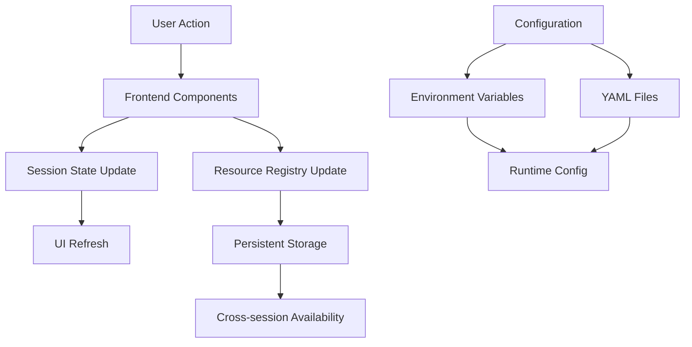

# Configuration Management and Session Persistence Analysis

## Executive Summary

This analysis evaluates the S3Vector demo application's configuration management system and session persistence implementation. The system demonstrates a sophisticated hierarchical configuration architecture with comprehensive environment-based settings, feature flags, and service endpoint management. Session persistence is implemented through multiple mechanisms including Streamlit session state, resource registry, and workflow state management.

## Configuration Management Assessment

### ✅ **Strengths**

#### 1. Hierarchical Configuration System
- **Multi-layer Configuration**: Well-structured system with environment variables, YAML files, and programmatic defaults
- **Environment-specific Overrides**: Separate configuration files for development, production, testing environments
- **ConfigManager Class**: Centralized configuration management with proper loading order and merging logic

```python
# Sophisticated configuration hierarchy from src/config/app_config.py
def _load_config(self):
    # 1. Start with defaults
    self._config = AppConfig()
    # 2. Load from environment variables  
    self._load_from_env()
    # 3. Load from config files
    if self.config_file.exists():
        self._load_from_file()
    # 4. Apply environment-specific overrides
    self._apply_environment_overrides()
```

#### 2. Comprehensive Feature Flag System
- **Granular Control**: 10+ feature flags for different functionality areas
- **Runtime Toggle**: Flags can be modified during runtime without restart
- **Environment Integration**: Proper environment variable fallback for all flags

```python
# Feature flags from app_config.py
@dataclass
class FeatureFlags:
    enable_real_aws: bool = False
    enable_opensearch_hybrid: bool = True
    enable_video_upload: bool = True
    enable_cost_estimation: bool = True
    enable_performance_monitoring: bool = True
    # ... and more
```

#### 3. Service Endpoint Configuration
- **Multiple Providers**: AWS, TwelveLabs, OpenSearch configurations
- **Access Method Selection**: Flexible configuration for Marengo 2.7 (Bedrock vs API access)
- **Regional Configuration**: Proper AWS region handling and service endpoint management

#### 4. Security Best Practices
- **No Hardcoded Secrets**: All sensitive values sourced from environment variables
- **Configuration Templates**: Comprehensive `.env.template` with documentation
- **Credential Separation**: Clear separation of different credential types and scopes

### ⚠️ **Areas for Improvement**

#### 1. Configuration Validation
- **Limited Runtime Validation**: Missing comprehensive validation of configuration interdependencies
- **Error Handling**: Configuration errors could be more descriptive with suggested fixes
- **Schema Validation**: No formal schema validation for YAML configuration files

#### 2. Dynamic Configuration Updates
- **Reload Limitations**: Configuration reloading doesn't validate all service dependencies
- **Hot Reload**: Limited support for applying configuration changes without restart
- **Change Tracking**: No audit trail for configuration changes

## Session Persistence Assessment

### ✅ **Strengths**

#### 1. Multi-layered State Management
The application implements several complementary persistence mechanisms:

- **Streamlit Session State**: In-memory session data for UI state
- **Resource Registry**: Persistent JSON-backed registry for AWS resources
- **Workflow State Manager**: Specialized state management for user workflows

```python
# From workflow_resource_manager.py
if 'workflow_state' not in st.session_state:
    st.session_state.workflow_state = {
        'last_session': None,
        'active_resources': {},
        'processing_history': [],
        'created_resources': [],
        'session_id': f"session_{int(time.time())}"
    }
```

#### 2. Resource Management State Preservation
- **Active Resource Tracking**: Persistent selection of S3 buckets, indexes, collections
- **Resource Creation History**: Complete audit trail of created resources
- **Cross-session Resource Discovery**: Resources created in different sessions are discoverable

#### 3. Workflow Progress Tracking
- **Processing Job State**: Comprehensive tracking of video processing jobs
- **Workflow Section Progress**: User progress through multi-step workflows
- **Resume Capabilities**: Users can resume work after interruptions

```python
# Workflow resume functionality
def render_workflow_resume_section(self):
    existing_resources = self._get_existing_resources()
    if not any(existing_resources.values()):
        st.info("👋 **Welcome!** No existing resources found.")
        return False
    
    st.success("✅ **Existing resources found!** You can resume your previous work.")
```

#### 4. Export/Import Session Data
- **Session Export**: JSON export of complete session state
- **Backup Capability**: Users can backup and restore session configurations
- **Cross-environment Migration**: Session data can be moved between deployments

### ⚠️ **Limitations and Gaps**

#### 1. Browser-dependent Session State
- **Memory-only Storage**: Streamlit session state is lost on browser refresh in some cases
- **Single Browser Limitation**: Sessions don't sync across different browsers/devices
- **No Server-side Session Store**: No persistent server-side session storage

#### 2. Workflow Continuity Gaps
- **Processing Job Recovery**: Long-running jobs may not survive application restarts
- **State Synchronization**: Resource registry and session state can become inconsistent
- **Automatic State Recovery**: No automatic detection and recovery of interrupted workflows

#### 3. Multi-user Session Isolation
- **User Identification**: Limited user identification and session isolation mechanisms
- **Concurrent Access**: Potential conflicts with multiple users accessing same resources
- **Permission Management**: No fine-grained permissions for resource access

## State Management Analysis

### Current Architecture

The application uses a hybrid approach with three main state management layers:

1. **Frontend Session State** (Streamlit session_state)
   - UI component state
   - Form data and user inputs
   - Temporary processing results

2. **Resource Registry** (Persistent JSON storage)
   - AWS resource tracking
   - Active resource selections
   - Resource creation/deletion history

3. **Configuration System** (Environment + File-based)
   - Application settings
   - Feature flags
   - Service configurations

### State Flow Analysis



## Workflow Resource Management Analysis

### ✅ **Sophisticated Workflow Management**

#### 1. Resource Lifecycle Management
- **Creation Wizard**: Comprehensive resource creation workflows
- **Resource Discovery**: Scanning and automatic registration of existing resources
- **Cleanup Management**: Selective and bulk resource cleanup capabilities

#### 2. User Experience Optimization
- **Resume Workflows**: Intelligent resume functionality for interrupted workflows
- **Resource Selection**: Streamlined active resource selection interface
- **Progress Tracking**: Clear workflow progress indicators and prerequisites

#### 3. Multi-pattern Support
- **Storage Pattern Selection**: Support for direct S3Vector and OpenSearch hybrid patterns
- **Configuration Persistence**: Storage pattern preferences maintained across sessions
- **Pattern Comparison**: Side-by-side performance comparison capabilities

### ⚠️ **Resource Management Gaps**

#### 1. Resource State Validation
- **Stale Resource Detection**: Limited validation of resource availability
- **State Consistency**: No automatic verification of resource registry accuracy
- **Health Monitoring**: Missing resource health checking capabilities

#### 2. Concurrent Resource Management
- **Resource Locking**: No mechanism to prevent concurrent resource modifications
- **Conflict Resolution**: Limited handling of resource conflicts between sessions
- **Resource Sharing**: No controlled resource sharing between users

## Security and Environment Variable Assessment

### ✅ **Security Best Practices**

#### 1. Credential Management
- **Environment Variable Usage**: All credentials sourced from environment variables
- **No Hardcoded Secrets**: Comprehensive audit shows no hardcoded sensitive values
- **Credential Separation**: Different credential types properly separated and scoped

#### 2. Configuration Security
- **Template-based Setup**: Secure `.env.template` prevents accidental secret exposure
- **Development vs Production**: Separate security configurations for different environments
- **CORS and XSRF Protection**: Configurable security headers and protections

#### 3. Access Control
- **AWS IAM Integration**: Proper AWS credential handling and IAM role support
- **Service-specific Credentials**: Separate credential management for different services
- **Region-based Configuration**: Proper regional configuration and endpoint management

### ⚠️ **Security Considerations**

#### 1. Configuration Exposure
- **Runtime Configuration Access**: Configuration values accessible through application interfaces
- **Debug Information**: Debug modes may expose configuration details
- **Error Messages**: Error messages might leak configuration information

#### 2. Session Security
- **Session Token Management**: Limited session token security mechanisms
- **Cross-site Session Handling**: Potential session vulnerabilities in multi-domain setups
- **Session Hijacking Prevention**: Basic session security measures

## Recommendations

### High Priority

1. **Implement Server-side Session Persistence**
   - Add database or file-based session storage
   - Enable cross-browser session continuity
   - Implement automatic session recovery mechanisms

2. **Enhance Configuration Validation**
   - Add comprehensive configuration schema validation
   - Implement dependency checking for configuration changes
   - Provide better error messages with remediation suggestions

3. **Improve State Synchronization**
   - Implement state consistency checks between session state and resource registry
   - Add automatic state synchronization mechanisms
   - Create state validation and recovery procedures

### Medium Priority

4. **Strengthen Security Measures**
   - Implement session encryption for sensitive data
   - Add configuration access logging and auditing
   - Enhance error message sanitization

5. **Add Multi-user Support**
   - Implement user identification and session isolation
   - Add resource permission management
   - Create concurrent access coordination

6. **Enhance Resource Management**
   - Add resource health monitoring
   - Implement resource state validation
   - Create resource conflict resolution mechanisms

### Low Priority

7. **Improve Developer Experience**
   - Add configuration hot-reloading capabilities
   - Create configuration validation CLI tools
   - Implement configuration change tracking

## Conclusion

The S3Vector demo application demonstrates a sophisticated and well-architected configuration management system with comprehensive environment-based settings, feature flags, and service configurations. The session persistence implementation provides multiple layers of state management with good user experience for workflow continuity.

**Key Strengths:**
- Hierarchical configuration system with proper environment separation
- Comprehensive feature flag implementation
- Multi-layered session persistence with export/import capabilities
- Sophisticated workflow resource management
- Strong security practices with proper credential management

**Critical Gaps:**
- Browser-dependent session state with limited cross-session continuity
- Limited server-side persistence for long-running operations
- Configuration validation and dependency checking could be stronger
- Multi-user session isolation needs improvement

**Overall Assessment:** The system provides a solid foundation for configuration management and session persistence, with room for enhancement in server-side persistence and multi-user scenarios. The architecture is well-suited for single-user demo scenarios but would benefit from additional persistence mechanisms for production deployment.