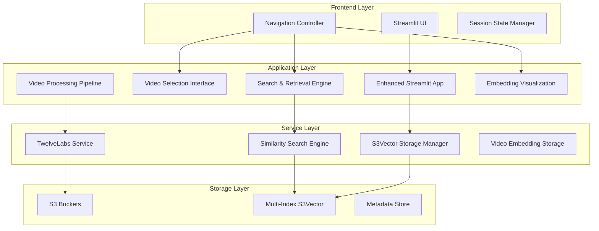
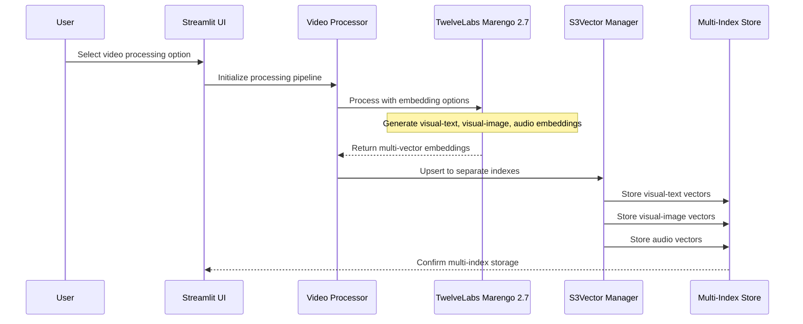
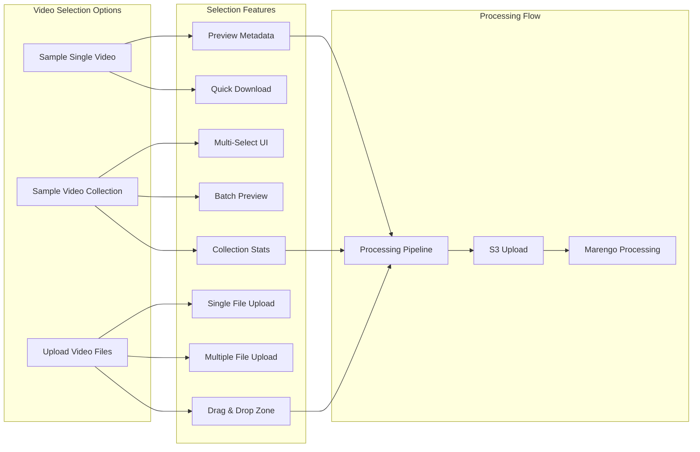
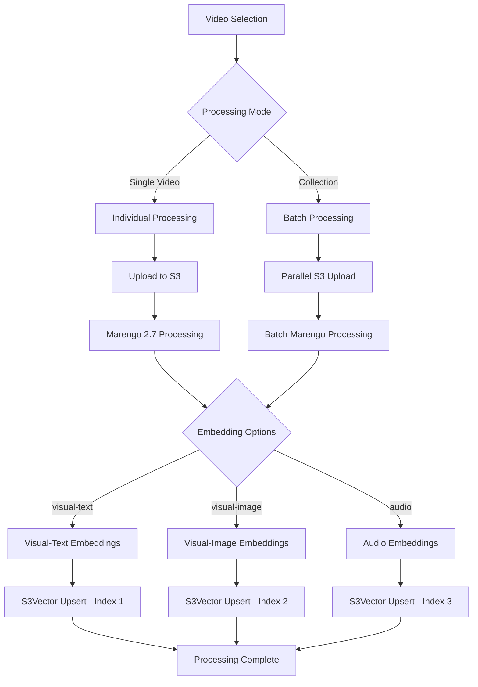
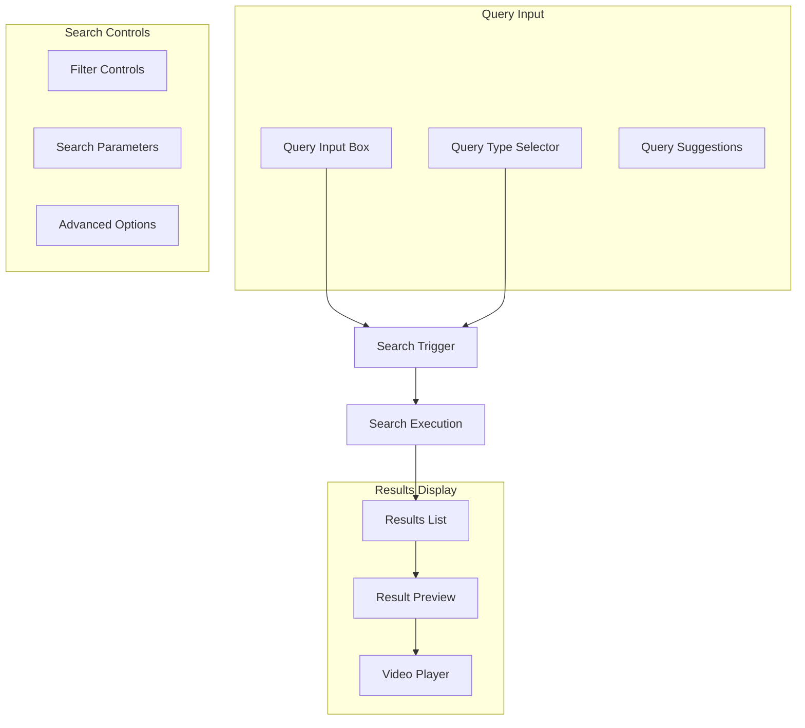

# Enhanced Streamlit Architecture Design
## Multi-Vector S3Vector Integration with Marengo 2.7 Processing

### Executive Summary

This document outlines the enhanced Streamlit architecture for the S3Vector project, designed to provide a comprehensive video-to-search pipeline with multi-vector processing capabilities, dual-page navigation, and advanced embedding visualization. The architecture leverages TwelveLabs Marengo 2.7 for multi-modal embedding generation and S3Vector's multi-index management for optimal search performance.

---

## 1. System Architecture Overview

### 1.1 High-Level Component Architecture



### 1.2 Multi-Vector Processing Flow



---

## 2. Enhanced Streamlit Application Structure

### 2.1 Core Application Class Enhancement

```python
class EnhancedStreamlitApp(UnifiedStreamlitApp):
    """Enhanced Streamlit app with multi-vector capabilities."""
    
    def __init__(self):
        super().__init__()
        self.multi_index_manager = MultiIndexManager()
        self.embedding_visualizer = EmbeddingVisualizer()
        
        # Enhanced session state
        if 'selected_videos' not in st.session_state:
            st.session_state.selected_videos = []
        if 'processing_queue' not in st.session_state:
            st.session_state.processing_queue = []
        if 'multi_indexes' not in st.session_state:
            st.session_state.multi_indexes = {}
```

### 2.2 Navigation Architecture

The application implements a dual-page navigation system:

#### Main Navigation:
- **Video Selection & Processing Page**
- **Vector Retrieval & Search Page**  
- **Embedding Visualization Page**
- **Analytics & Management Page**

#### Sub-Navigation:
- Processing: Upload → Configure → Process → Monitor
- Search: Query → Filter → Results → Playback
- Visualization: Reduce → Color → Interact → Analyze

---

## 3. Video Selection Interface Design

### 3.1 Three-Option Selection Interface



### 3.2 Enhanced Video Selection Features

#### Sample Single Video:
- **Preview Cards**: Rich preview with thumbnail, metadata, duration
- **Quick Actions**: One-click download and processing
- **Category Filtering**: Filter by animation, action, sci-fi, etc.
- **Quality Indicators**: Resolution, file size, processing cost estimation

#### Sample Video Collection:
- **Multi-Select Interface**: Checkbox-based selection with live preview
- **Batch Statistics**: Total duration, storage requirements, cost projection
- **Collection Management**: Save/load video collections for reuse
- **Smart Recommendations**: Suggest videos based on previous selections

#### Upload Video Files:
- **Drag-and-Drop Zone**: Intuitive file upload interface
- **Progress Tracking**: Real-time upload progress with speed indication
- **File Validation**: Format checking, size limits, duration validation
- **Batch Upload**: Multiple file selection with queue management

---

## 4. Multi-Vector Processing Pipeline

### 4.1 Marengo 2.7 Integration Strategy

```python
class MultiVectorProcessor:
    """Handles multi-vector embedding generation and storage."""
    
    EMBEDDING_OPTIONS = {
        'visual-text': {
            'index_suffix': 'visual-text',
            'dimension': 1024,
            'description': 'Visual content with text overlay analysis'
        },
        'visual-image': {
            'index_suffix': 'visual-image', 
            'dimension': 1024,
            'description': 'Pure visual content analysis'
        },
        'audio': {
            'index_suffix': 'audio',
            'dimension': 1024, 
            'description': 'Audio content and speech analysis'
        }
    }
```

### 4.2 Multi-Index S3Vector Strategy

#### Index Organization:
- **Base Index Name**: `video-search-{timestamp}`
- **Visual-Text Index**: `video-search-{timestamp}-visual-text`
- **Visual-Image Index**: `video-search-{timestamp}-visual-image`  
- **Audio Index**: `video-search-{timestamp}-audio`

#### Index Configuration:
```json
{
  "index_template": {
    "embedding_dimension": 1024,
    "distance_metric": "cosine",
    "metadata_schema": {
      "video_id": "string",
      "segment_index": "integer", 
      "start_sec": "float",
      "end_sec": "float",
      "embedding_type": "string",
      "processing_config": "object"
    }
  }
}
```

### 4.3 Processing Workflow Enhancement



---

## 5. Dual Page Architecture

### 5.1 Vector Retrieval Page Design

#### Query Type Detection System:
```python
class QueryTypeDetector:
    """Automatically detects query intent and routes to appropriate index."""
    
    def detect_query_type(self, query: str) -> QueryType:
        # Visual content queries
        if self._contains_visual_keywords(query):
            return QueryType.VISUAL_TEXT
        
        # Audio/speech queries  
        elif self._contains_audio_keywords(query):
            return QueryType.AUDIO
            
        # Pure visual queries
        elif self._contains_image_keywords(query):
            return QueryType.VISUAL_IMAGE
            
        # Default to comprehensive search
        else:
            return QueryType.MULTI_INDEX
```

#### Search Interface Components:



### 5.2 Embedding Visualization Page Design

#### Visualization Pipeline:
```python
class EmbeddingVisualizer:
    """Advanced embedding space visualization with multi-index support."""
    
    def __init__(self):
        self.reduction_methods = ['PCA', 't-SNE', 'UMAP']
        self.color_schemes = ['by_embedding_type', 'by_video', 'by_similarity']
        
    def create_multi_index_visualization(self, 
                                       embeddings: Dict[str, np.ndarray],
                                       method: str = 'PCA',
                                       dimensions: str = '3D') -> plotly.Figure:
        """Create visualization showing multiple embedding types."""
```

#### Interactive Features:
- **Multi-Index Overlay**: Visualize different embedding types simultaneously
- **Dynamic Filtering**: Filter by embedding type, video source, similarity score
- **Query Projection**: Show where new queries would land in embedding space
- **Cluster Analysis**: Automatic clustering with interpretable labels
- **Export Capabilities**: Save visualizations and cluster analysis

---

## 6. Integration Patterns

### 6.1 S3Vector Multi-Index Management

```python
class MultiIndexManager:
    """Manages multiple S3Vector indexes for different embedding types."""
    
    def create_multi_index_set(self, base_name: str, 
                              embedding_options: List[str]) -> Dict[str, str]:
        """Create a set of related indexes for different embedding types."""
        indexes = {}
        for option in embedding_options:
            index_name = f"{base_name}-{option}"
            index_arn = self.s3_manager.create_vector_index(
                bucket_name=self.bucket_name,
                index_name=index_name,
                embedding_dimension=1024
            )
            indexes[option] = index_arn
        return indexes
    
    def search_multi_index(self, query: SimilarityQuery) -> SearchResults:
        """Search across multiple indexes and merge results."""
        all_results = []
        
        # Determine which indexes to search based on query
        target_indexes = self._get_target_indexes(query)
        
        # Execute parallel searches
        for index_type, index_arn in target_indexes.items():
            results = self.search_engine.search_by_text_query(
                query_text=query.query_text,
                index_arn=index_arn,
                index_type=IndexType.MARENGO_MULTIMODAL,
                top_k=query.top_k
            )
            # Tag results with embedding type
            for result in results.results:
                result.embedding_type = index_type
            all_results.extend(results.results)
        
        # Merge and rank results
        return self._merge_and_rank_results(all_results, query.top_k)
```

### 6.2 TwelveLabs API Integration

```python
class EnhancedTwelveLabsProcessor:
    """Enhanced TwelveLabs processor with multi-vector support."""
    
    def process_video_multi_vector(self, 
                                 video_s3_uri: str,
                                 embedding_options: List[str],
                                 segment_duration: float = 5.0) -> MultiVectorResult:
        """Process video generating multiple embedding types."""
        
        results = {}
        for option in embedding_options:
            # Configure Marengo for specific embedding type
            config = {
                'model_id': 'twelvelabs.marengo-embed-2-7-v1:0',
                'embedding_type': option,
                'segment_config': {
                    'use_fixed_length_sec': segment_duration,
                    'min_clip_sec': 4
                }
            }
            
            # Process with TwelveLabs
            result = self.bedrock_runtime.invoke_model(
                modelId=config['model_id'],
                contentType='application/json',
                accept='application/json',
                body=json.dumps({
                    'inputVideo': {'s3Uri': video_s3_uri},
                    'embeddingConfig': config
                })
            )
            
            results[option] = result
            
        return MultiVectorResult(results)
```

### 6.3 AWS S3 Bucket Coordination

#### Bucket Organization Strategy:
```
s3://video-processing-bucket/
├── raw-videos/
│   ├── uploads/
│   ├── samples/
│   └── temp/
├── processed-outputs/
│   ├── embeddings/
│   ├── metadata/
│   └── thumbnails/
└── index-data/
    ├── visual-text/
    ├── visual-image/
    └── audio/
```

#### Cross-Service Integration:
```python
class S3BucketCoordinator:
    """Coordinates S3 operations across video processing and vector storage."""
    
    def setup_processing_pipeline(self, bucket_name: str):
        """Set up S3 bucket structure for video processing."""
        
        # Create folder structure
        folders = [
            'raw-videos/uploads/',
            'raw-videos/samples/', 
            'raw-videos/temp/',
            'processed-outputs/embeddings/',
            'processed-outputs/metadata/',
            'processed-outputs/thumbnails/',
            'index-data/visual-text/',
            'index-data/visual-image/',
            'index-data/audio/'
        ]
        
        for folder in folders:
            self.s3_client.put_object(
                Bucket=bucket_name,
                Key=folder,
                Body=b''
            )
```

---

## 7. Real-Time Progress Tracking

### 7.1 Progress Tracking Architecture

```python
class ProgressTracker:
    """Real-time progress tracking for video processing operations."""
    
    def __init__(self):
        self.progress_store = {}
        
    def track_video_processing(self, job_id: str, 
                             total_videos: int) -> ProgressContext:
        """Create progress tracking context for video processing."""
        
        return ProgressContext(
            job_id=job_id,
            total_operations=total_videos * 3,  # 3 embedding types
            progress_callback=self._update_streamlit_progress,
            error_callback=self._handle_processing_error
        )
    
    def _update_streamlit_progress(self, job_id: str, 
                                 completed: int, total: int):
        """Update Streamlit progress indicators."""
        if 'progress_bars' in st.session_state:
            progress = completed / total
            st.session_state.progress_bars[job_id].progress(progress)
            
            # Update status text
            status_text = f"Processing: {completed}/{total} operations complete"
            st.session_state.status_texts[job_id].text(status_text)
```

### 7.2 Progress UI Components

```python
def render_progress_tracking(self):
    """Render real-time progress tracking interface."""
    
    if st.session_state.get('processing_jobs'):
        st.subheader("🔄 Processing Status")
        
        for job_id, job_info in st.session_state.processing_jobs.items():
            with st.container():
                col1, col2, col3 = st.columns([2, 1, 1])
                
                with col1:
                    st.markdown(f"**Job**: {job_info['name']}")
                    progress_bar = st.progress(job_info['progress'])
                    st.session_state.progress_bars[job_id] = progress_bar
                    
                with col2:
                    st.metric("Videos", f"{job_info['completed']}/{job_info['total']}")
                    
                with col3:
                    if job_info['status'] == 'running':
                        st.success("🟢 Active")
                    elif job_info['status'] == 'completed':
                        st.success("✅ Done")
                    else:
                        st.error("❌ Error")
```

---

## 8. Performance and Scalability Considerations

### 8.1 Performance Optimization Strategies

#### Caching Strategy:
```python
class EmbeddingCache:
    """Intelligent caching for embedding operations."""
    
    def __init__(self):
        self.memory_cache = {}
        self.s3_cache_bucket = "s3vector-embedding-cache"
        
    def get_cached_embedding(self, video_uri: str, 
                           embedding_type: str) -> Optional[np.ndarray]:
        """Retrieve cached embedding if available."""
        cache_key = f"{video_uri}#{embedding_type}"
        
        # Check memory cache first
        if cache_key in self.memory_cache:
            return self.memory_cache[cache_key]
            
        # Check S3 cache
        return self._get_s3_cached_embedding(cache_key)
```

#### Parallel Processing:
```python
class ParallelProcessor:
    """Parallel video processing with configurable concurrency."""
    
    def __init__(self, max_concurrent: int = 3):
        self.max_concurrent = max_concurrent
        self.executor = ThreadPoolExecutor(max_workers=max_concurrent)
        
    async def process_video_batch(self, videos: List[str]) -> List[ProcessingResult]:
        """Process multiple videos concurrently."""
        tasks = []
        for video_uri in videos:
            task = self.executor.submit(self._process_single_video, video_uri)
            tasks.append(task)
            
        # Process results as they complete
        results = []
        for future in as_completed(tasks):
            result = await future
            results.append(result)
            
        return results
```

### 8.2 Scalability Architecture

#### Auto-Scaling Components:
- **Processing Queue**: Redis-based queue for batch processing
- **Worker Scaling**: Auto-scale processing workers based on queue depth
- **Index Sharding**: Distribute large indexes across multiple S3Vector instances
- **CDN Integration**: CloudFront distribution for video content delivery

#### Resource Management:
```python
class ResourceManager:
    """Manages resource allocation and scaling decisions."""
    
    def __init__(self):
        self.metrics = CloudWatchMetrics()
        self.autoscaler = AutoScaler()
        
    def monitor_processing_load(self):
        """Monitor system load and trigger scaling decisions."""
        queue_depth = self.get_processing_queue_depth()
        processing_latency = self.metrics.get_average_processing_time()
        
        if queue_depth > 10 and processing_latency > 300:  # 5 minutes
            self.autoscaler.scale_up_workers()
            
        elif queue_depth < 2 and processing_latency < 60:  # 1 minute
            self.autoscaler.scale_down_workers()
```

---

## 9. Error Handling and Recovery

### 9.1 Comprehensive Error Handling

```python
class ProcessingErrorHandler:
    """Handles errors in video processing pipeline with recovery strategies."""
    
    def handle_processing_error(self, error: Exception, 
                              context: ProcessingContext) -> RecoveryAction:
        """Determine appropriate recovery action based on error type."""
        
        if isinstance(error, TwelveLabsQuotaExceeded):
            return RecoveryAction.RETRY_WITH_BACKOFF
            
        elif isinstance(error, S3VectorIndexFull):
            return RecoveryAction.CREATE_NEW_INDEX
            
        elif isinstance(error, VideoFormatNotSupported):
            return RecoveryAction.SKIP_WITH_WARNING
            
        else:
            return RecoveryAction.FAIL_WITH_NOTIFICATION
```

### 9.2 User Experience During Errors

```python
def render_error_recovery_ui(self, error_context: ErrorContext):
    """Render user-friendly error recovery interface."""
    
    st.error(f"Processing Error: {error_context.friendly_message}")
    
    if error_context.recovery_options:
        st.markdown("**Recovery Options:**")
        
        col1, col2, col3 = st.columns(3)
        
        with col1:
            if st.button("🔄 Retry Processing"):
                self._retry_processing(error_context)
                
        with col2:
            if st.button("⏭️ Skip This Video"):
                self._skip_video(error_context.video_id)
                
        with col3:
            if st.button("🛑 Cancel Batch"):
                self._cancel_batch_processing()
```

---

## 10. Security and Compliance

### 10.1 Data Security Measures

#### Encryption Strategy:
- **Data in Transit**: TLS 1.3 for all API communications
- **Data at Rest**: AES-256 encryption for S3 storage
- **Key Management**: AWS KMS for encryption key lifecycle

#### Access Control:
```python
class SecurityManager:
    """Manages security policies and access control."""
    
    def __init__(self):
        self.iam_client = boto3.client('iam')
        self.kms_client = boto3.client('kms')
        
    def create_processing_role(self, bucket_name: str) -> str:
        """Create IAM role with minimal required permissions."""
        policy = {
            "Version": "2012-10-17",
            "Statement": [
                {
                    "Effect": "Allow",
                    "Action": [
                        "s3:GetObject",
                        "s3:PutObject"
                    ],
                    "Resource": f"arn:aws:s3:::{bucket_name}/*"
                },
                {
                    "Effect": "Allow", 
                    "Action": [
                        "s3vectors:Query",
                        "s3vectors:UpsertVector"
                    ],
                    "Resource": f"arn:aws:s3vectors:*:*:bucket/{bucket_name}/*"
                }
            ]
        }
        
        return self._create_role_with_policy(policy)
```

### 10.2 Compliance and Auditing

#### Audit Trail:
```python
class AuditLogger:
    """Comprehensive audit logging for compliance."""
    
    def log_video_processing(self, user_id: str, video_uri: str, 
                           embedding_types: List[str]):
        """Log video processing activity."""
        audit_event = {
            'event_type': 'video_processing',
            'timestamp': datetime.utcnow().isoformat(),
            'user_id': user_id,
            'video_uri': video_uri,
            'embedding_types': embedding_types,
            'ip_address': self._get_client_ip(),
            'session_id': self._get_session_id()
        }
        
        self.cloudtrail.put_events(Records=[audit_event])
```

---

## 11. Testing and Quality Assurance

### 11.1 Testing Strategy

#### Unit Testing:
```python
class TestMultiVectorProcessing:
    """Unit tests for multi-vector processing functionality."""
    
    def test_embedding_generation(self):
        """Test multi-vector embedding generation."""
        processor = MultiVectorProcessor()
        
        # Mock video input
        video_uri = "s3://test-bucket/sample-video.mp4"
        embedding_options = ['visual-text', 'audio']
        
        results = processor.process_video_multi_vector(
            video_uri, embedding_options
        )
        
        assert len(results.embeddings) == 2
        assert 'visual-text' in results.embeddings
        assert 'audio' in results.embeddings
```

#### Integration Testing:
```python
class TestEndToEndProcessing:
    """End-to-end testing of complete processing pipeline."""
    
    def test_complete_video_pipeline(self):
        """Test complete video processing and search pipeline."""
        app = EnhancedStreamlitApp()
        
        # Upload and process video
        video_path = self._get_test_video()
        result = app.process_video_with_multi_vectors(video_path)
        
        assert result.success == True
        assert len(result.indexes_created) == 3
        
        # Test search functionality  
        search_results = app.search_multi_index("test query")
        assert len(search_results) > 0
```

### 11.2 Quality Metrics

#### Performance Benchmarks:
- **Processing Time**: < 2 minutes per minute of video
- **Search Latency**: < 500ms for similarity queries
- **Memory Usage**: < 2GB per concurrent processing job
- **Storage Efficiency**: < 10KB per video segment

#### Quality Assurance Checklist:
- [ ] Multi-vector embedding generation accuracy
- [ ] Index separation and query routing
- [ ] UI responsiveness under load
- [ ] Error recovery functionality
- [ ] Data security compliance
- [ ] Cross-browser compatibility
- [ ] Mobile responsiveness

---

## 12. Implementation Roadmap

### Phase 1: Core Architecture (Weeks 1-2)
- [ ] Enhanced Streamlit app structure
- [ ] Multi-index manager implementation
- [ ] Basic multi-vector processing pipeline
- [ ] Three-option video selection interface

### Phase 2: Processing Enhancement (Weeks 3-4)  
- [ ] TwelveLabs Marengo 2.7 integration
- [ ] S3Vector multi-index upsert logic
- [ ] Progress tracking system
- [ ] Error handling and recovery

### Phase 3: Search and Visualization (Weeks 5-6)
- [ ] Vector retrieval page with query detection
- [ ] Multi-index search coordination
- [ ] Embedding visualization page
- [ ] Interactive visualization features

### Phase 4: Optimization and Polish (Weeks 7-8)
- [ ] Performance optimization
- [ ] Security hardening  
- [ ] Comprehensive testing
- [ ] Documentation and deployment

---

## 13. Deployment and Operations

### 13.1 Deployment Architecture

```yaml
# docker-compose.yml for enhanced Streamlit deployment
version: '3.8'
services:
  streamlit-app:
    build: .
    ports:
      - "8501:8501"
    environment:
      - AWS_REGION=us-east-1
      - S3_VECTOR_BUCKET=enhanced-video-search
      - REDIS_URL=redis://redis:6379
    depends_on:
      - redis
      
  redis:
    image: redis:7-alpine
    ports:
      - "6379:6379"
      
  nginx:
    image: nginx:alpine
    ports:
      - "80:80" 
      - "443:443"
    volumes:
      - ./nginx.conf:/etc/nginx/nginx.conf
```

### 13.2 Monitoring and Alerting

```python
class OperationalMetrics:
    """Operational monitoring and alerting system."""
    
    def __init__(self):
        self.cloudwatch = boto3.client('cloudwatch')
        
    def publish_processing_metrics(self, job_id: str, 
                                 duration: float, success: bool):
        """Publish processing metrics to CloudWatch."""
        self.cloudwatch.put_metric_data(
            Namespace='S3Vector/VideoProcessing',
            MetricData=[
                {
                    'MetricName': 'ProcessingDuration',
                    'Value': duration,
                    'Unit': 'Seconds',
                    'Dimensions': [
                        {'Name': 'JobId', 'Value': job_id}
                    ]
                },
                {
                    'MetricName': 'ProcessingSuccess',
                    'Value': 1 if success else 0,
                    'Unit': 'Count'
                }
            ]
        )
```

---

## 14. Conclusion

The enhanced Streamlit architecture provides a comprehensive solution for multi-vector video processing and search. Key architectural strengths include:

### 14.1 Technical Excellence
- **Scalable Multi-Vector Processing**: Efficient handling of multiple embedding types
- **Intelligent Query Routing**: Automatic detection and routing to appropriate indexes
- **Real-Time Progress Tracking**: Comprehensive monitoring of processing operations
- **Advanced Visualization**: Interactive embedding space exploration

### 14.2 User Experience  
- **Intuitive Navigation**: Clear dual-page architecture with logical flow
- **Flexible Video Selection**: Three distinct input methods for different use cases
- **Rich Visualizations**: Advanced embedding space visualization with multiple interaction modes
- **Comprehensive Error Handling**: Graceful error recovery with user-friendly interfaces

### 14.3 Operational Robustness
- **Security by Design**: Comprehensive security measures and compliance
- **Performance Optimized**: Caching, parallel processing, and resource management  
- **Comprehensive Testing**: Unit, integration, and end-to-end testing strategies
- **Production Ready**: Full deployment, monitoring, and operational procedures

This architecture positions the S3Vector project as a leading solution for enterprise-grade video search and analysis, leveraging the latest in multi-modal AI and vector storage technologies.

---

**Document Version**: 1.0  
**Last Updated**: 2025-09-02  
**Author**: System Architecture Designer  
**Review Status**: Ready for Implementation