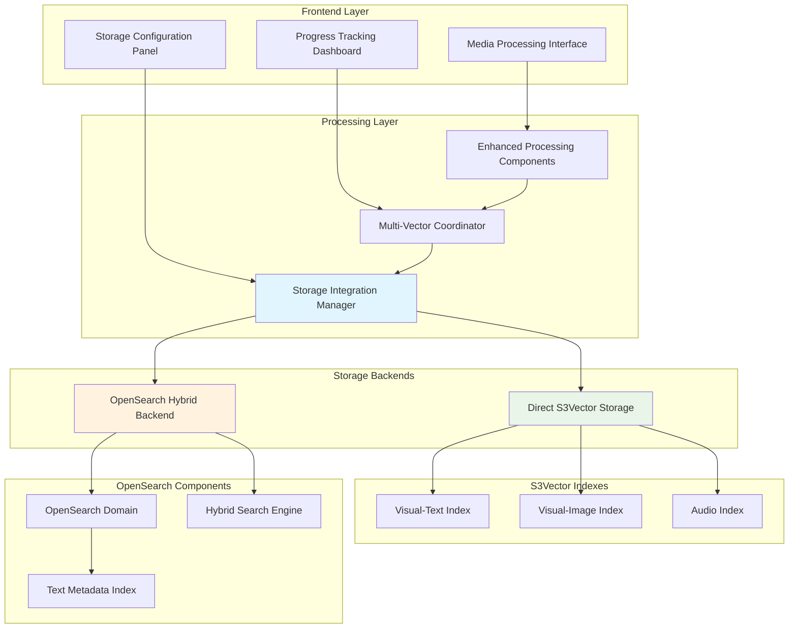

# Enhanced Media Processing Architecture with Dual Backend Storage

## Overview

This document outlines the enhanced architecture for the Media Processing interface that implements post-processing storage integration with dual backend support, automatic upsertion, and comprehensive metadata preservation.

## Architecture Components

### 1. Dual Backend Storage Architecture



### 2. Storage Pattern Implementation

#### Direct S3Vector Pattern
- **Purpose**: High-performance vector similarity search
- **Components**: S3Vector buckets and indexes
- **Benefits**: Low latency, cost-effective, unlimited scalability
- **Use Cases**: Pure vector search, high-performance requirements

#### OpenSearch Hybrid Pattern
- **Purpose**: Combined vector + text search capabilities
- **Components**: OpenSearch managed domains with S3Vector engine
- **Benefits**: Rich query language, advanced filtering, hybrid search
- **Use Cases**: Complex search requirements, text + vector fusion

### 3. Metadata Preservation System

```python
@dataclass
class MediaMetadata:
    """Comprehensive metadata for media files."""
    # File Information
    file_name: str
    s3_storage_location: str
    file_format: str
    file_size_bytes: int
    
    # Media Properties
    duration_seconds: float
    resolution: Optional[str]
    frame_rate: Optional[float]
    audio_channels: Optional[int]
    
    # Processing Information
    processing_timestamp: str
    segment_count: int
    segment_duration: float
    vector_types_generated: List[str]
    
    # Embedding Metadata
    embedding_model: str
    embedding_dimensions: Dict[str, int]
    processing_cost_usd: Optional[float]
    
    # Business Metadata
    content_category: Optional[str]
    tags: List[str]
    custom_metadata: Dict[str, Any]
```

### 4. Index Segregation Strategy

#### Naming Convention
```
{environment}-{content_type}-{vector_type}-{version}

Examples:
- prod-video-visual-text-v1
- prod-video-visual-image-v1  
- prod-video-audio-v1
- dev-video-visual-text-v1
```

#### Index Configuration
```python
INDEX_CONFIGURATIONS = {
    "visual-text": {
        "dimensions": 1024,
        "distance_metric": "cosine",
        "metadata_keys": ["file_name", "duration", "segment_id", "timestamp"]
    },
    "visual-image": {
        "dimensions": 1024,
        "distance_metric": "cosine", 
        "metadata_keys": ["file_name", "resolution", "frame_number", "timestamp"]
    },
    "audio": {
        "dimensions": 1024,
        "distance_metric": "cosine",
        "metadata_keys": ["file_name", "audio_channels", "segment_id", "timestamp"]
    }
}
```

## Implementation Plan

### Phase 1: Enhanced Storage Configuration
1. **Storage Pattern Selection Enhancement**
   - Dual backend configuration UI
   - Validation and compatibility checks
   - Real-time cost estimation

2. **Backend Initialization**
   - S3Vector bucket and index creation
   - OpenSearch domain setup with S3Vector engine
   - Connection validation

### Phase 2: Automatic Upsertion System
1. **Dual Storage Manager**
   - Parallel upsertion to both backends
   - Consistency validation
   - Error handling and retry logic

2. **Metadata Integration**
   - Comprehensive metadata extraction
   - Schema validation
   - Cross-backend metadata synchronization

### Phase 3: Index Segregation
1. **Embedding-Specific Indexes**
   - Separate indexes per vector type
   - Optimized configurations per embedding type
   - Cross-index search capabilities

2. **Batch Processing**
   - Multi-file processing workflows
   - Progress tracking and reporting
   - Resource optimization

### Phase 4: Advanced Features
1. **Error Handling & Recovery**
   - Comprehensive error classification
   - Automatic retry mechanisms
   - Fallback strategies

2. **Performance Optimization**
   - Caching strategies
   - Connection pooling
   - Resource monitoring

## Key Benefits

1. **Flexibility**: Choose optimal storage backend per use case
2. **Performance**: Optimized configurations for each vector type
3. **Scalability**: Independent scaling of storage backends
4. **Reliability**: Comprehensive error handling and recovery
5. **Observability**: Detailed progress tracking and monitoring
6. **Cost Optimization**: Intelligent backend selection based on usage patterns

## Technical Specifications

### Storage Integration Manager
- **Purpose**: Orchestrate dual backend operations
- **Responsibilities**: 
  - Backend selection and validation
  - Parallel upsertion coordination
  - Metadata synchronization
  - Error handling and recovery

### Enhanced Processing Components
- **Purpose**: Integrate storage operations with processing workflows
- **Responsibilities**:
  - Media file processing coordination
  - Progress tracking and reporting
  - Batch processing management
  - Cost estimation and monitoring

### Validation Framework
- **Purpose**: Ensure data integrity across backends
- **Responsibilities**:
  - Schema validation
  - Consistency checks
  - Performance monitoring
  - Health checks

This architecture provides a robust, scalable foundation for dual backend storage integration while maintaining the flexibility to optimize for different use cases and requirements.