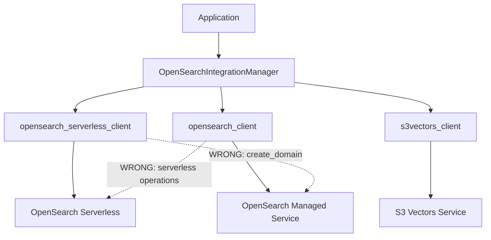
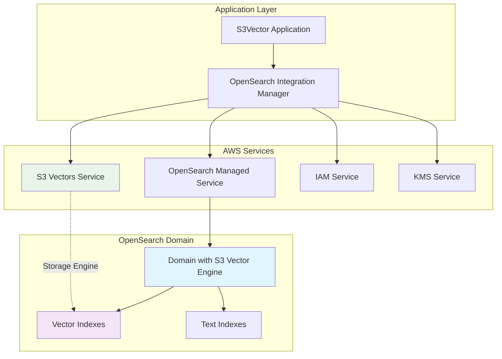
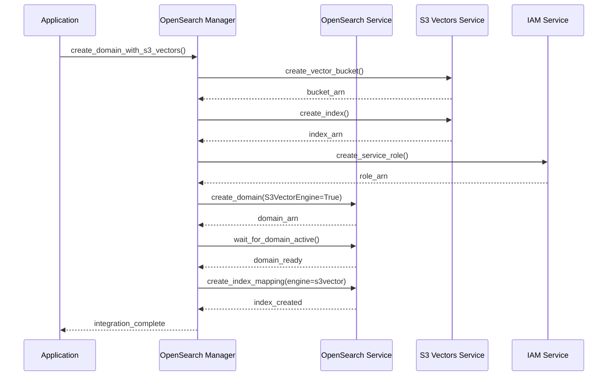

# OpenSearch S3 Vector Pattern 2 Architecture Analysis & Design

## Executive Summary

The current OpenSearch integration implementation contains critical architectural flaws that prevent proper Pattern 2 (S3 Vector Engine) integration with OpenSearch managed domains. This document provides a comprehensive analysis of the issues and the correct architectural design for AWS OpenSearch managed clusters with S3 Vector backend.

## Critical Issues Identified

### 1. **Incorrect Service Client Usage**

**Problem**: The current code incorrectly uses `opensearchserverless` client to call `create_domain` method:

```python
# INCORRECT - Lines 148-151 in opensearch_integration.py
self.opensearch_serverless_client = session.client(
    'opensearchserverless',  # Wrong service for managed domains
    config=self.boto_config
)

# Then attempting to create domains with serverless client
# This is fundamentally wrong for Pattern 2
```

**Root Cause**: Confusion between OpenSearch Service patterns:
- **Pattern 1 (Export)**: Uses OpenSearch **Serverless** collections
- **Pattern 2 (Engine)**: Uses OpenSearch **managed domains**

### 2. **Service Boundary Violations**

**Current Architecture (Incorrect)**:


### 3. **Pattern Confusion in Implementation**

The code conflates two distinct AWS OpenSearch integration patterns:

| Aspect | Pattern 1 (Export) | Pattern 2 (Engine) |
|--------|-------------------|-------------------|
| **Target Service** | OpenSearch Serverless | OpenSearch Managed Domains |
| **Client Type** | `opensearchserverless` | `opensearch` |
| **Resource Creation** | Collections | Domains |
| **S3 Vector Role** | Data source for export | Storage engine |
| **Data Flow** | S3 Vectors → Export → Serverless | S3 Vectors ↔ Domain Engine |

## Correct Pattern 2 Architecture

### 1. **Service Architecture Overview**



### 2. **Correct Client Configuration**

```python
class OpenSearchS3VectorIntegration:
    """Correct implementation for Pattern 2 (Engine)"""
    
    def __init__(self, region_name: str = "us-east-1"):
        self.region_name = region_name
        self.boto_config = Config(
            retries={'max_attempts': 3, 'mode': 'adaptive'},
            read_timeout=60,
            connect_timeout=10,
            max_pool_connections=50
        )
        
        # CORRECT: Use appropriate clients for Pattern 2
        session = boto3.Session(region_name=self.region_name)
        
        # For OpenSearch MANAGED domains (Pattern 2)
        self.opensearch_client = session.client(
            'opensearch',  # CORRECT: managed service client
            config=self.boto_config
        )
        
        # For S3 Vector operations
        self.s3vectors_client = session.client(
            's3vectors',
            config=self.boto_config
        )
        
        # For IAM role management
        self.iam_client = session.client(
            'iam',
            config=self.boto_config
        )
        
        # NOTE: NO opensearchserverless client needed for Pattern 2
```

### 3. **Domain Creation Workflow**

```python
def create_opensearch_domain_with_s3_vectors(
    self,
    domain_name: str,
    s3_vector_bucket_arn: str,
    instance_type: str = "or1.medium.search",  # OR1 instances required for S3 Vectors
    instance_count: int = 1,
    kms_key_id: Optional[str] = None
) -> Dict[str, Any]:
    """
    Create OpenSearch managed domain with S3 Vector engine support.
    
    This is the CORRECT implementation for Pattern 2.
    """
    
    # Step 1: Create domain configuration
    domain_config = {
        'DomainName': domain_name,
        'EngineVersion': 'OpenSearch_2.19',  # Minimum version for S3 vectors
        
        # Cluster configuration
        'ClusterConfig': {
            'InstanceType': instance_type,
            'InstanceCount': instance_count,
            'DedicatedMasterEnabled': False,
            'ZoneAwarenessEnabled': True if instance_count > 1 else False
        },
        
        # Storage configuration
        'EBSOptions': {
            'EBSEnabled': True,
            'VolumeType': 'gp3',
            'VolumeSize': 20,
            'Iops': 3000
        },
        
        # S3 Vector engine configuration (correct AWS API format)
        'AIMLOptions': {
            'S3VectorsEngine': {
                'Enabled': True
                # Note: S3VectorBucketArn is not supported in create_domain API
            }
        },
        
        # Security configuration
        'EncryptionAtRestOptions': {
            'Enabled': True
        },
        
        'NodeToNodeEncryptionOptions': {
            'Enabled': True
        },
        
        'DomainEndpointOptions': {
            'EnforceHTTPS': True,
            'TLSSecurityPolicy': 'Policy-Min-TLS-1-2-2019-07'
        }
    }
    
    # Add KMS encryption if specified
    if kms_key_id:
        domain_config['EncryptionAtRestOptions']['KmsKeyId'] = kms_key_id
        # Note: KmsKeyId for S3VectorsEngine is not supported in create_domain API
    
    # Step 2: Create the domain using CORRECT client
    try:
        response = self.opensearch_client.create_domain(**domain_config)
        
        domain_arn = response['DomainStatus']['ARN']
        domain_endpoint = response['DomainStatus']['Endpoint']
        
        # Step 3: Wait for domain to be active
        self._wait_for_domain_active(domain_name)
        
        return {
            'domain_name': domain_name,
            'domain_arn': domain_arn,
            'domain_endpoint': domain_endpoint,
            's3_vector_engine_enabled': True,
            'status': 'active'
        }
        
    except ClientError as e:
        if e.response['Error']['Code'] == 'InvalidParameterValue':
            raise OpenSearchIntegrationError(
                f"Invalid S3 Vector configuration: {e.response['Error']['Message']}"
            )
        raise OpenSearchIntegrationError(f"Domain creation failed: {str(e)}")
```

### 4. **S3 Vector Index Integration**

```python
def create_vector_index_mapping(
    self,
    domain_endpoint: str,
    index_name: str,
    vector_field_name: str,
    vector_dimension: int,
    s3_vector_index_arn: str,
    space_type: str = "cosine"
) -> Dict[str, Any]:
    """
    Create OpenSearch index mapping that uses S3 Vector as storage engine.
    """
    
    # Index mapping with S3 Vector engine
    mapping = {
        "settings": {
            "index": {
                "knn": True,
                "knn.algo_param.ef_search": 512,
                "number_of_shards": 2,
                "number_of_replicas": 1
            }
        },
        "mappings": {
            "properties": {
                vector_field_name: {
                    "type": "knn_vector",
                    "dimension": vector_dimension,
                    "space_type": space_type,
                    "method": {
                        "name": "hnsw",
                        "engine": "s3vector",  # CRITICAL: Use S3 Vector engine
                        "parameters": {
                            "s3_vector_index_arn": s3_vector_index_arn,
                            "ef_construction": 512,
                            "m": 16
                        }
                    }
                },
                # Additional fields for hybrid search
                "title": {"type": "text", "analyzer": "english"},
                "content": {"type": "text", "analyzer": "english"},
                "metadata": {
                    "type": "object",
                    "properties": {
                        "category": {"type": "keyword"},
                        "timestamp": {"type": "date"},
                        "tags": {"type": "keyword"}
                    }
                }
            }
        }
    }
    
    # Create index via OpenSearch REST API
    import requests
    from requests_aws4auth import AWS4Auth
    
    # AWS authentication for OpenSearch
    credentials = boto3.Session().get_credentials()
    awsauth = AWS4Auth(
        credentials.access_key,
        credentials.secret_key,
        self.region_name,
        'es',
        session_token=credentials.token
    )
    
    url = f"https://{domain_endpoint}/{index_name}"
    response = requests.put(
        url,
        json=mapping,
        auth=awsauth,
        headers={"Content-Type": "application/json"}
    )
    
    if response.status_code not in [200, 201]:
        raise OpenSearchIntegrationError(
            f"Failed to create S3 vector index: {response.status_code} {response.text}"
        )
    
    return {
        "index_name": index_name,
        "vector_field": vector_field_name,
        "s3_vector_engine": True,
        "s3_vector_index_arn": s3_vector_index_arn,
        "created": True
    }
```

## Pattern Comparison Matrix

### Pattern 1 (Export) vs Pattern 2 (Engine)

| Component | Pattern 1 (Export) | Pattern 2 (Engine) |
|-----------|-------------------|-------------------|
| **AWS Service** | OpenSearch Serverless | OpenSearch Managed Service |
| **Client Type** | `opensearchserverless` | `opensearch` |
| **Resource Type** | Collections | Domains |
| **Creation Method** | `create_collection()` | `create_domain()` |
| **S3 Vector Role** | Data source | Storage engine |
| **Data Storage** | Dual (S3 + OpenSearch) | Single (S3 via engine) |
| **Cost Model** | OCU-based + S3 storage | Instance-based + S3 storage |
| **Query Latency** | Low (native OpenSearch) | Medium (engine overhead) |
| **Use Case** | High-performance queries | Cost-optimized analytics |

### Implementation Differences

```python
# Pattern 1 (Export) - CORRECT implementation
class ExportPatternIntegration:
    def __init__(self):
        # Use serverless client for collections
        self.opensearch_serverless_client = boto3.client('opensearchserverless')
        self.osis_client = boto3.client('osis')  # For ingestion pipelines
    
    def create_export_target(self, collection_name: str):
        # Create serverless collection
        return self.opensearch_serverless_client.create_collection(
            name=collection_name,
            type='VECTORSEARCH'
        )

# Pattern 2 (Engine) - CORRECT implementation  
class EnginePatternIntegration:
    def __init__(self):
        # Use managed service client for domains
        self.opensearch_client = boto3.client('opensearch')
    
    def create_engine_target(self, domain_name: str, s3_vector_bucket_arn: str):
        # Create managed domain with S3 vector engine
        return self.opensearch_client.create_domain(
            DomainName=domain_name,
            EngineVersion='OpenSearch_2.19',
            AIMLOptions={
                'S3VectorsEngine': {
                    'Enabled': True
                    # Note: S3VectorBucketArn not supported in create_domain API
                }
            }
        )
```

## Required IAM Permissions

### Pattern 2 (Engine) Permissions

```json
{
    "Version": "2012-10-17",
    "Statement": [
        {
            "Effect": "Allow",
            "Action": [
                "es:CreateDomain",
                "es:UpdateDomainConfig", 
                "es:DescribeDomain",
                "es:DeleteDomain",
                "es:ESHttpGet",
                "es:ESHttpPost",
                "es:ESHttpPut",
                "es:ESHttpDelete"
            ],
            "Resource": "arn:aws:es:*:*:domain/*"
        },
        {
            "Effect": "Allow",
            "Action": [
                "s3vectors:CreateVectorBucket",
                "s3vectors:GetVectorBucket",
                "s3vectors:ListVectorBuckets",
                "s3vectors:CreateIndex",
                "s3vectors:GetIndex",
                "s3vectors:ListIndexes",
                "s3vectors:PutVectors",
                "s3vectors:QueryVectors"
            ],
            "Resource": "*"
        },
        {
            "Effect": "Allow",
            "Action": [
                "iam:CreateRole",
                "iam:PutRolePolicy",
                "iam:PassRole"
            ],
            "Resource": "arn:aws:iam::*:role/opensearch-s3vector-*"
        }
    ]
}
```

## Deployment Architecture

### Correct Pattern 2 Deployment Flow



## Migration Strategy

### From Current (Incorrect) to Correct Implementation

1. **Phase 1: Client Refactoring**
   - Remove `opensearchserverless` client usage for domain operations
   - Ensure `opensearch` client is used for all managed domain operations
   - Update method signatures to reflect correct service boundaries

2. **Phase 2: Resource Creation Logic**
   - Replace collection creation with domain creation
   - Update S3 Vector integration to use engine pattern
   - Implement proper IAM role creation for domain access

3. **Phase 3: Index Management**
   - Update index creation to use S3 Vector engine specification
   - Implement proper vector field mapping with engine parameters
   - Add hybrid search capabilities with correct query routing

## Performance Considerations

### Pattern 2 Optimization Guidelines

1. **Instance Selection**
   - Use OpenSearch Optimized OR1 instances (required for S3 Vectors engine)
   - Minimum: or1.medium.search for production workloads
   - Scale horizontally for high query volumes

2. **S3 Vector Configuration**
   - Use appropriate vector dimensions (match embedding model)
   - Select optimal distance metric (cosine for normalized vectors)
   - Configure proper HNSW parameters (ef_construction, m)

3. **Query Optimization**
   - Implement result caching for frequent queries
   - Use batch operations for multiple vector searches
   - Balance vector vs text search weights based on use case

## Monitoring and Observability

### Key Metrics for Pattern 2

```python
monitoring_metrics = {
    "domain_health": [
        "cluster_status",
        "node_count",
        "storage_utilization"
    ],
    "s3_vector_performance": [
        "vector_query_latency",
        "vector_index_size",
        "query_throughput"
    ],
    "cost_tracking": [
        "instance_hours",
        "storage_costs",
        "data_transfer_costs"
    ],
    "error_monitoring": [
        "failed_queries",
        "timeout_errors",
        "authentication_failures"
    ]
}
```

## Conclusion

The current OpenSearch integration implementation suffers from fundamental architectural flaws that prevent proper Pattern 2 (S3 Vector Engine) functionality. The key issues are:

1. **Service Client Confusion**: Using serverless clients for managed domain operations
2. **Pattern Mixing**: Conflating export and engine integration patterns  
3. **Resource Type Mismatch**: Attempting to create domains with collection APIs

The correct Pattern 2 architecture requires:
- Using `opensearch` client for managed domains
- Proper S3 Vector engine configuration in domain creation
- Correct index mapping with S3 Vector engine specification
- Appropriate IAM permissions for cross-service integration

This architectural correction will enable proper hybrid search capabilities combining S3 Vector storage efficiency with OpenSearch query flexibility.