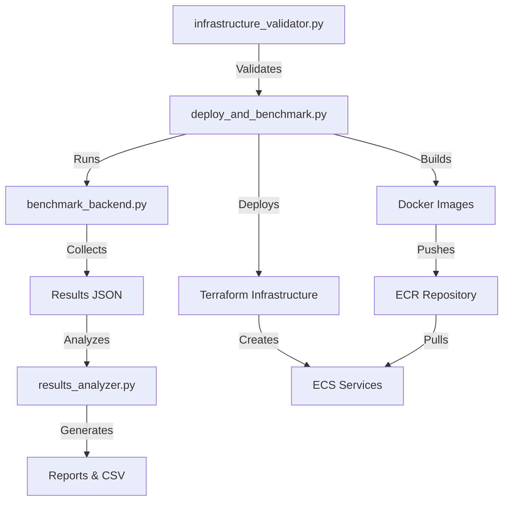

# Videolake Deployment & Benchmarking Orchestration

Complete automation system for deploying Videolake infrastructure, building Docker images, deploying backends, running benchmarks, and analyzing results.

## Overview

The orchestration system consists of five main components:

1. **[`deploy_and_benchmark.py`](../scripts/deploy_and_benchmark.py)** - Main orchestration script
2. **[`benchmark_backend.py`](../scripts/benchmark_backend.py)** - Individual backend benchmark runner
3. **[`benchmark_bedrock_multimodal.py`](../scripts/benchmark_bedrock_multimodal.py)** - Multi-modal video embedding benchmark with AWS Bedrock Marengo
4. **[`results_analyzer.py`](../scripts/results_analyzer.py)** - Results analysis and comparison
5. **[`infrastructure_validator.py`](../scripts/infrastructure_validator.py)** - Pre-deployment validation

## Quick Start

### 1. Validate Prerequisites

Before deployment, validate your environment:

```bash
# Basic validation
python scripts/infrastructure_validator.py

# Comprehensive validation (includes network and IAM checks)
python scripts/infrastructure_validator.py --comprehensive

# Validate specific backend
python scripts/infrastructure_validator.py --backend lancedb-s3
```

### 2. Deploy & Benchmark

```bash
# Deploy and benchmark S3Vector backend
python scripts/deploy_and_benchmark.py --backends s3vector

# Deploy and benchmark multiple backends
python scripts/deploy_and_benchmark.py --backends s3vector lancedb-s3 opensearch

# Deploy all backends
python scripts/deploy_and_benchmark.py --all-backends

# Benchmark only (skip deployment)
python scripts/deploy_and_benchmark.py --backends s3vector --benchmark-only

# Deploy, benchmark, and destroy
python scripts/deploy_and_benchmark.py --backends s3vector --destroy-after
```

### 3. Analyze Results

```bash
# Analyze and compare results
python scripts/results_analyzer.py --directory ./benchmark-results --compare

# Export to CSV
python scripts/results_analyzer.py --results results.json --csv output.csv
```

## Supported Backends

| Backend ID | Name | Docker Required | Description |
|------------|------|-----------------|-------------|
| `s3vector` | S3Vector Direct | No | Native S3-based vector storage |
| `opensearch` | OpenSearch + S3Vector | No | OpenSearch with S3Vector integration |
| `lancedb-s3` | LanceDB + S3 | Yes | LanceDB with S3 backend |
| `lancedb-efs` | LanceDB + EFS | Yes | LanceDB with EFS storage |
| `lancedb-ebs` | LanceDB + EBS | Yes | LanceDB with EBS volumes |
| `qdrant-efs` | Qdrant + EFS | No | Qdrant with EFS storage |
| `qdrant-ebs` | Qdrant + EBS | No | Qdrant with EBS volumes |

## Main Orchestration Script

### [`deploy_and_benchmark.py`](../scripts/deploy_and_benchmark.py)

Complete workflow orchestration from infrastructure deployment to results reporting.

**Features:**
- Terraform infrastructure deployment
- Docker image build and ECR push
- Multi-backend deployment
- Health checks and readiness waiting
- Comprehensive benchmarking
- Results collection and reporting

**Usage:**

```bash
python scripts/deploy_and_benchmark.py [OPTIONS]
```

**Options:**

| Option | Description |
|--------|-------------|
| `--backends` | Backend IDs to deploy (space-separated) |
| `--all-backends` | Deploy all supported backends |
| `--skip-deploy` | Skip infrastructure deployment |
| `--skip-docker` | Skip Docker build/push |
| `--benchmark-only` | Only run benchmarks |
| `--destroy-after` | Destroy infrastructure after completion |
| `--output-dir` | Output directory for results (default: `./benchmark-results`) |
| `--timeout` | Timeout for backend readiness (default: 600s) |

**Examples:**

```bash
# Standard deployment and benchmark
python scripts/deploy_and_benchmark.py --backends s3vector lancedb-s3

# Quick benchmark on existing deployment
python scripts/deploy_and_benchmark.py --backends s3vector --benchmark-only

# Full workflow with cleanup
python scripts/deploy_and_benchmark.py --backends s3vector --destroy-after

# All backends, skip Docker (for non-LanceDB backends)
python scripts/deploy_and_benchmark.py --all-backends --skip-docker
```

**Workflow:**

1. **Infrastructure Deployment** (unless `--skip-deploy`)
   - Terraform init/plan/apply for each backend
   - Capture terraform outputs
   
2. **Docker Management** (unless `--skip-docker`)
   - Build LanceDB Docker image
   - Push to ECR (if LanceDB backends selected)
   
3. **Backend Readiness**
   - Wait for ECS services to be healthy
   - Verify connectivity
   
4. **Benchmarking**
   - Index test datasets (10, 100, 1000 vectors)
   - Run search queries (10, 50, 100 queries)
   - Measure latency and throughput
   
5. **Results Collection**
   - Save JSON results
   - Generate markdown report
   - Create summary statistics

**Output Files:**

```
benchmark-results/
├── orchestration_YYYYMMDD_HHMMSS.log  # Full orchestration log
├── results_YYYYMMDD_HHMMSS.json       # Detailed results
├── summary.json                        # Summary statistics
└── report_YYYYMMDD_HHMMSS.md          # Markdown report
```

## Backend Benchmark Runner

### [`benchmark_backend.py`](../scripts/benchmark_backend.py)

Individual backend benchmark execution. Called by orchestrator or run standalone.

**Features:**
- Index performance testing
- Search latency measurement
- Mixed workload testing
- Resource usage tracking

**Usage:**

```bash
python scripts/benchmark_backend.py --backend BACKEND --operation OPERATION [OPTIONS]
```

**Options:**

| Option | Description | Default |
|--------|-------------|---------|
| `--backend` | Backend ID (required) | - |
| `--operation` | Operation: `index`, `search`, `mixed` | - |
| `--vectors` | Vector count for indexing | 1000 |
| `--queries` | Query count for search | 100 |
| `--duration` | Duration for mixed workload (seconds) | 60 |
| `--top-k` | Results per query | 10 |
| `--endpoint` | Backend endpoint URL | Auto-detected |
| `--output` | Output JSON file | - |

**Examples:**

```bash
# Index 1000 vectors
python scripts/benchmark_backend.py \
  --backend s3vector \
  --operation index \
  --vectors 1000

# Search benchmark
python scripts/benchmark_backend.py \
  --backend lancedb-s3 \
  --operation search \
  --queries 100 \
  --top-k 10

# Mixed workload for 60 seconds
python scripts/benchmark_backend.py \
  --backend opensearch \
  --operation mixed \
  --duration 60

# Custom endpoint and save results
python scripts/benchmark_backend.py \
  --backend s3vector \
  --operation index \
  --vectors 5000 \
  --endpoint http://custom-endpoint:8000 \
  --output results.json
```

**Benchmark Metrics:**

- **Index**: Duration, throughput (vectors/sec)
- **Search**: Latency (p50, p95, p99), throughput (QPS)
- **Mixed**: Operations count, ops/sec, error rate
- **Resources**: Memory usage, CPU utilization

## AWS Bedrock Multi-Modal Benchmark

### [`benchmark_bedrock_multimodal.py`](../scripts/benchmark_bedrock_multimodal.py)

Production-grade benchmarking workflow for AWS Bedrock Marengo model that generates multi-vector embeddings (text-vision, image-vision, audio) from video data and benchmarks all Videolake backends with identical embedding data.

**Features:**
- Video dataset management with caching
- S3 upload with multipart support
- AWS Bedrock Marengo embedding generation
- Multi-modal embedding extraction (text, image, audio)
- Multi-backend insertion and benchmarking
- Comprehensive performance comparison
- Selective cleanup with S3 preservation

**Workflow:**

1. **Video Dataset Management**
   - Downloads specified dataset (MSR-VTT, ActivityNet, Kinetics)
   - Validates video files (format, size, duration)
   - Caches locally to avoid re-downloads

2. **S3 Upload & Organization**
   - Uploads videos to S3 with organized prefixes (`videos/source/`)
   - Handles large files with multipart upload
   - Shows progress indicators

3. **Bedrock Embedding Generation**
   - Triggers Bedrock async inference using Marengo model
   - Generates 3 embedding types: text-vision, image-vision, audio
   - Monitors job progress with retry logic
   - Handles job failures gracefully

4. **Embedding Extraction**
   - Extracts embeddings from S3 output
   - Parses Bedrock output format (JSON/JSONL)
   - Organizes by modality

5. **Backend Insertion**
   - Creates separate indices per modality
   - Batch upserts embeddings to each backend
   - Uses identical data across all backends

6. **Comprehensive Benchmarking**
   - Executes query suites per modality
   - Measures: latency (p50, p95, p99), throughput (QPS), recall@K
   - Tracks resource utilization (CPU, memory)
   - Fair comparison with identical queries

7. **Results & Cleanup**
   - Generates markdown report with comparison tables
   - Exports detailed JSON results
   - Optional index cleanup
   - Preserves S3 bucket contents by default

**Usage:**

```bash
python scripts/benchmark_bedrock_multimodal.py [OPTIONS]
```

**Options:**

| Option | Description | Default |
|--------|-------------|---------|
| `--dataset` | Dataset name (required) | - |
| `--s3-bucket` | S3 bucket for storage (required) | - |
| `--backends` | Backends to benchmark | `s3vector` |
| `--modalities` | Embedding modalities | `text image audio` |
| `--query-count` | Queries per modality | 100 |
| `--skip-download` | Skip dataset download | False |
| `--skip-upload` | Skip S3 upload | False |
| `--skip-embedding` | Skip Bedrock generation | False |
| `--cleanup-indices` | Delete indices after benchmark | False |
| `--preserve-s3` | Keep S3 data | True |
| `--output-dir` | Results directory | `./benchmark-results` |
| `--aws-region` | AWS region | `us-east-1` |
| `--batch-size` | Embedding upsert batch size | 100 |
| `--job-timeout` | Bedrock job timeout (seconds) | 3600 |

**Available Datasets:**

| Dataset | Videos | Size | Description |
|---------|--------|------|-------------|
| `msrvtt-100` | 100 | ~500 MB | MSR-VTT Sample |
| `activitynet-200` | 200 | ~1 GB | ActivityNet Sample |
| `kinetics-50` | 50 | ~300 MB | Kinetics Sample |

**Examples:**

```bash
# Basic benchmark with S3Vector only
python scripts/benchmark_bedrock_multimodal.py \
  --dataset msrvtt-100 \
  --s3-bucket videolake-embeddings \
  --backends s3vector

# Multi-backend comprehensive benchmark
python scripts/benchmark_bedrock_multimodal.py \
  --dataset activitynet-200 \
  --s3-bucket videolake-embeddings \
  --backends s3vector opensearch lancedb-s3 qdrant-efs \
  --modalities text image audio \
  --query-count 100

# Resume from cached embeddings (skip download and generation)
python scripts/benchmark_bedrock_multimodal.py \
  --dataset msrvtt-100 \
  --s3-bucket videolake-embeddings \
  --skip-download --skip-upload --skip-embedding \
  --backends lancedb-efs qdrant-ebs

# Single modality benchmark with cleanup
python scripts/benchmark_bedrock_multimodal.py \
  --dataset kinetics-50 \
  --s3-bucket videolake-embeddings \
  --backends s3vector opensearch \
  --modalities text \
  --query-count 50 \
  --cleanup-indices

# Large-scale benchmark with custom batch size
python scripts/benchmark_bedrock_multimodal.py \
  --dataset activitynet-200 \
  --s3-bucket videolake-embeddings \
  --backends s3vector lancedb-s3 lancedb-efs qdrant-efs \
  --modalities text image audio \
  --query-count 200 \
  --batch-size 200 \
  --job-timeout 7200
```

**Output Files:**

```
benchmark-results/
├── benchmark_YYYYMMDD_HHMMSS.log           # Detailed orchestration log
├── bedrock_benchmark_YYYYMMDD_HHMMSS.md    # Markdown comparison report
└── bedrock_benchmark_YYYYMMDD_HHMMSS.json  # Detailed JSON results
```

**Report Contents:**

The generated markdown report includes:

1. **Executive Summary**
   - Performance leaders (latency, throughput)
   - Overall winners by modality

2. **Detailed Results per Backend**
   - Latency metrics (mean, P50, P95, P99)
   - Performance metrics (throughput, error rate)
   - Recall@K for different K values
   - Resource usage (CPU, memory, disk I/O)

3. **Cross-Backend Comparison Tables**
   - Side-by-side comparison per modality
   - Easy identification of best performers

4. **Configuration Details**
   - Full configuration used
   - Link to detailed JSON results

**Integration with Bedrock:**

The script integrates with AWS Bedrock's Marengo model for multi-modal embedding generation:

- **Model ID:** `amazon.marengo-2.7`
- **Input:** Video files in S3
- **Output:** Three embedding types per video:
  - Text-vision embeddings (semantic understanding)
  - Image-vision embeddings (visual features)
  - Audio embeddings (acoustic features)
- **Dimension:** Typically 1024 (configurable)
- **Job Type:** Async batch inference
- **Region:** us-east-1 (Bedrock availability)

**Best Practices:**

1. **Start Small:** Test with `msrvtt-100` before scaling up
2. **Cache Effectively:** Use `--skip-*` flags to resume workflows
3. **Monitor Costs:** Bedrock inference and S3 storage incur charges
4. **Preserve Data:** Keep `--preserve-s3` enabled (default) for reruns
5. **Batch Wisely:** Adjust `--batch-size` based on backend capacity
6. **Regional Limits:** Ensure adequate Bedrock quota in us-east-1

**Troubleshooting:**

**Issue: Bedrock job timeout**
```bash
# Solution: Increase timeout for large datasets
python scripts/benchmark_bedrock_multimodal.py \
  --dataset activitynet-200 \
  --s3-bucket videolake-embeddings \
  --job-timeout 7200
```

**Issue: S3 bucket already exists**
```bash
# Solution: Use existing bucket or choose different name
# The script will use existing bucket if found
```

**Issue: Out of memory during embedding extraction**
```bash
# Solution: Reduce batch size
python scripts/benchmark_bedrock_multimodal.py \
  --dataset msrvtt-100 \
  --s3-bucket videolake-embeddings \
  --batch-size 50  # Reduced from default 100
```

**Issue: Backend provider initialization fails**
```bash
# Solution: Check backend is properly configured
# Ensure credentials and endpoints are accessible
python scripts/infrastructure_validator.py --backend lancedb-s3
```

## Results Analyzer

### [`results_analyzer.py`](../scripts/results_analyzer.py)

Analyze and compare benchmark results across backends.

**Features:**
- Statistical analysis
- Backend comparison
- Performance rankings
- Recommendations
- CSV export

**Usage:**

```bash
python scripts/results_analyzer.py [OPTIONS]
```

**Options:**

| Option | Description |
|--------|-------------|
| `--results` | Result files (JSON, space-separated) |
| `--directory` | Directory with result files |
| `--compare` | Generate comparison report |
| `--output` | Output file (default: `analysis_report.md`) |
| `--csv` | Export to CSV file |

**Examples:**

```bash
# Analyze single result file
python scripts/results_analyzer.py \
  --results results1.json \
  --compare

# Analyze multiple files
python scripts/results_analyzer.py \
  --results results1.json results2.json results3.json \
  --compare \
  --output comparison.md

# Analyze all results in directory
python scripts/results_analyzer.py \
  --directory ./benchmark-results \
  --compare \
  --csv export.csv

# Export to CSV only
python scripts/results_analyzer.py \
  --directory ./benchmark-results \
  --csv results.csv
```

**Report Contents:**

1. **Index Performance Comparison**
   - Average throughput (vectors/sec)
   - Average duration
   - Ranked by performance

2. **Search Performance Comparison**
   - Latency percentiles (p50, p95, p99)
   - Average throughput (QPS)
   - Ranked by performance

3. **Rankings**
   - Fastest index backend
   - Fastest search backend
   - Most consistent performer

4. **Recommendations**
   - Workload-specific suggestions
   - Performance warnings
   - Best-fit use cases

## Infrastructure Validator

### [`infrastructure_validator.py`](../scripts/infrastructure_validator.py)

Pre-deployment validation to ensure all prerequisites are met.

**Features:**
- AWS credentials verification
- Tool installation checks
- Docker daemon status
- IAM permissions validation
- Port availability
- Disk space check

**Usage:**

```bash
python scripts/infrastructure_validator.py [OPTIONS]
```

**Options:**

| Option | Description |
|--------|-------------|
| `--backend` | Validate specific backend |
| `--comprehensive` | Run comprehensive checks |
| `--verbose` | Detailed output |

**Examples:**

```bash
# Basic validation
python scripts/infrastructure_validator.py

# Comprehensive with verbose output
python scripts/infrastructure_validator.py --comprehensive --verbose

# Backend-specific validation
python scripts/infrastructure_validator.py --backend lancedb-s3

# Quick check before deployment
python scripts/infrastructure_validator.py && \
python scripts/deploy_and_benchmark.py --backends s3vector
```

**Validation Checks:**

✓ **Core Requirements:**
- Python 3.8+
- Terraform installed
- AWS CLI configured
- AWS credentials valid
- AWS region set

✓ **Comprehensive Checks:**
- Docker daemon running (for LanceDB)
- Network connectivity to AWS
- IAM permissions (S3, EC2, ECS, ECR)
- Disk space available
- Required ports available (8000, 8080, 3000)

✓ **Backend-Specific:**
- Terraform state initialized
- Required dependencies available

**Exit Codes:**
- `0` - All checks passed
- `1` - Validation failed

## Complete Workflow Examples

### Example 1: Single Backend Full Workflow

```bash
# 1. Validate prerequisites
python scripts/infrastructure_validator.py --backend s3vector --comprehensive

# 2. Deploy and benchmark
python scripts/deploy_and_benchmark.py \
  --backends s3vector \
  --output-dir ./results-s3vector

# 3. Analyze results
python scripts/results_analyzer.py \
  --directory ./results-s3vector \
  --compare \
  --output s3vector-report.md
```

### Example 2: Multi-Backend Comparison

```bash
# 1. Validate all backends
python scripts/infrastructure_validator.py --comprehensive

# 2. Deploy and benchmark all backends
python scripts/deploy_and_benchmark.py \
  --all-backends \
  --output-dir ./results-all-backends \
  --timeout 900

# 3. Compare all backends
python scripts/results_analyzer.py \
  --directory ./results-all-backends \
  --compare \
  --output all-backends-comparison.md \
  --csv all-backends-data.csv
```

### Example 3: Rapid Testing Cycle

```bash
# Deploy once
python scripts/deploy_and_benchmark.py \
  --backends s3vector lancedb-s3 \
  --skip-benchmark

# Run multiple benchmark rounds
for i in {1..3}; do
  echo "Round $i"
  python scripts/deploy_and_benchmark.py \
    --backends s3vector lancedb-s3 \
    --benchmark-only \
    --output-dir ./results-round-$i
done

# Analyze all rounds
python scripts/results_analyzer.py \
  --directory ./results-round-* \
  --compare \
  --output multi-round-comparison.md

# Cleanup
python scripts/deploy_and_benchmark.py \
  --backends s3vector lancedb-s3 \
  --destroy-after \
  --skip-benchmark
```

### Example 4: Individual Backend Benchmarking

```bash
# Deploy backend
python scripts/deploy_and_benchmark.py \
  --backends lancedb-s3 \
  --skip-benchmark

# Custom benchmarks
python scripts/benchmark_backend.py \
  --backend lancedb-s3 \
  --operation index \
  --vectors 10000 \
  --output index-10k.json

python scripts/benchmark_backend.py \
  --backend lancedb-s3 \
  --operation search \
  --queries 1000 \
  --top-k 100 \
  --output search-1k.json

python scripts/benchmark_backend.py \
  --backend lancedb-s3 \
  --operation mixed \
  --duration 300 \
  --output mixed-5min.json

# Analyze custom results
python scripts/results_analyzer.py \
  --results index-10k.json search-1k.json mixed-5min.json \
  --compare
```

## Best Practices

### Pre-Deployment

1. **Always validate first:**
   ```bash
   python scripts/infrastructure_validator.py --comprehensive
   ```

2. **Check AWS costs:** Review terraform plans before applying

3. **Start small:** Test with single backend before scaling

### During Deployment

1. **Monitor logs:** Check `benchmark-results/*.log` for issues

2. **Resource limits:** AWS has service quotas (ECS tasks, EBS volumes, etc.)

3. **Timeout adjustments:** Complex backends may need `--timeout 900` or higher

4. **Network stability:** Ensure stable connection during deployment

### Post-Deployment

1. **Review results:** Check generated reports for anomalies

2. **Compare baselines:** Track performance over time

3. **Cleanup:** Use `--destroy-after` or manually destroy with terraform

4. **Cost monitoring:** Check AWS billing for unexpected charges

## Troubleshooting

### Common Issues

**Issue: Terraform state locked**
```bash
# Solution: Force unlock (use with caution)
cd terraform/backends/s3vector
terraform force-unlock <LOCK_ID>
```

**Issue: Docker build fails**
```bash
# Solution: Check Docker daemon
sudo systemctl status docker
sudo systemctl start docker
```

**Issue: ECS service unhealthy**
```bash
# Solution: Check ECS logs
aws logs tail /ecs/videolake-cluster --follow

# Check service status
aws ecs describe-services \
  --cluster videolake-cluster \
  --services s3vector-api
```

**Issue: Benchmark connection timeout**
```bash
# Solution: Verify endpoint is accessible
curl http://backend-endpoint:8000/health

# Check security groups allow traffic
aws ec2 describe-security-groups --group-ids <SG_ID>
```

**Issue: Out of memory during benchmarking**
```bash
# Solution: Reduce vector counts
python scripts/benchmark_backend.py \
  --backend s3vector \
  --operation index \
  --vectors 500  # Reduced from 1000
```

### Debug Mode

Enable verbose logging:

```bash
# Orchestrator with detailed logging
python scripts/deploy_and_benchmark.py \
  --backends s3vector \
  2>&1 | tee deployment-debug.log

# Validator with verbose output
python scripts/infrastructure_validator.py \
  --comprehensive \
  --verbose

# Check specific terraform output
cd terraform/backends/s3vector
terraform output -json
```

## Architecture



## Performance Metrics

### What Gets Measured

**Index Operations:**
- Total duration (seconds)
- Throughput (vectors per second)
- Memory usage during indexing
- Success/failure rate

**Search Operations:**
- Latency percentiles (p50, p95, p99) in milliseconds
- Throughput (queries per second)
- Result accuracy (if ground truth available)
- Memory usage during search

**Mixed Workload:**
- Total operations completed
- Operations per second
- Error rate percentage
- Resource stability

## Cost Estimation

Approximate AWS costs for benchmark runs:

| Backend | Hourly Cost | 24h Cost | Notes |
|---------|-------------|----------|-------|
| S3Vector | ~$0.10 | ~$2.40 | ECS Fargate + S3 |
| OpenSearch | ~$0.50 | ~$12.00 | t3.medium instance |
| LanceDB-S3 | ~$0.15 | ~$3.60 | ECS Fargate + S3 |
| LanceDB-EFS | ~$0.20 | ~$4.80 | ECS Fargate + EFS |
| LanceDB-EBS | ~$0.25 | ~$6.00 | ECS EC2 + EBS |
| Qdrant-EFS | ~$0.20 | ~$4.80 | ECS Fargate + EFS |
| Qdrant-EBS | ~$0.25 | ~$6.00 | ECS EC2 + EBS |

**Cost Optimization:**
- Use `--destroy-after` to minimize runtime
- Deploy only needed backends
- Use `--benchmark-only` for repeat tests
- Monitor with AWS Cost Explorer

## Contributing

See [`CONTRIBUTING.md`](../CONTRIBUTING.md) for contribution guidelines.

## Related Documentation

- [**Deployment Guide**](./DEPLOYMENT_GUIDE.md) - Manual deployment instructions
- [**Architecture Overview**](./ARCHITECTURE.md) - System architecture
- [**Troubleshooting Guide**](./troubleshooting-guide.md) - Common issues
- [**ECR Module README**](../terraform/modules/ecr_lancedb/README.md) - ECR infrastructure
- [**LanceDB API README**](../docker/lancedb-api/README.md) - Docker image details

## License

See [LICENSE](../LICENSE) for details.