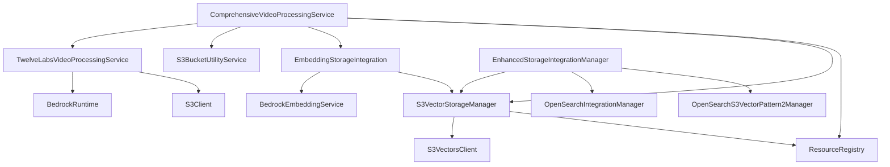

# Service Enhancement Architectural Analysis

## Executive Summary

This document provides a comprehensive analysis of the current S3Vector service architecture, identifying service relationships, dependencies, redundancies, and optimization opportunities. The analysis reveals a complex but well-structured system with several areas for consolidation and enhanced resource utilization.

## Current Service Landscape

### Core Services Identified

#### 1. ComprehensiveVideoProcessingService
- **Location**: [`src/services/comprehensive_video_processing_service.py`](src/services/comprehensive_video_processing_service.py:1)
- **Purpose**: Orchestrates end-to-end video processing workflow
- **Key Features**:
  - Video download from URLs using [`S3BucketUtilityService`](src/services/comprehensive_video_processing_service.py:148)
  - Bedrock Marengo 2.7 processing (primary) with TwelveLabs fallback
  - Multi-vector type support: [`visual-text`, `visual-image`, `audio`](src/services/comprehensive_video_processing_service.py:64-66)
  - S3Vector storage integration via [`EmbeddingStorageIntegration`](src/services/comprehensive_video_processing_service.py:150)
  - Resource registry integration for optimal bucket selection

#### 2. TwelveLabsVideoProcessingService
- **Location**: [`src/services/twelvelabs_video_processing.py`](src/services/twelvelabs_video_processing.py:1)
- **Purpose**: TwelveLabs Marengo model video embedding generation
- **Key Features**:
  - Async job processing with [`AsyncJobInfo`](src/services/twelvelabs_video_processing.py:41) tracking
  - Multi-vector processing: [`visual-text`, `visual-image`, `audio`](src/services/twelvelabs_video_processing.py:70)
  - Optimized single-job multi-embedding generation
  - Thread pool execution with [`ThreadPoolExecutor`](src/services/twelvelabs_video_processing.py:126)

#### 3. S3VectorStorageManager
- **Location**: [`src/services/s3_vector_storage.py`](src/services/s3_vector_storage.py:1)
- **Purpose**: S3 Vector bucket and index management
- **Key Features**:
  - Multi-index architecture support
  - Vector type configurations for [`visual-text`, `visual-image`, `audio`, `text-titan`](src/services/s3_vector_storage.py:76-81)
  - Concurrent operations with [`ThreadPoolExecutor`](src/services/s3_vector_storage.py:73)
  - Resource registry integration

#### 4. EmbeddingStorageIntegration
- **Location**: [`src/services/embedding_storage_integration.py`](src/services/embedding_storage_integration.py:1)
- **Purpose**: Bedrock embedding generation with S3Vector storage
- **Key Features**:
  - Text embedding processing
  - Batch processing capabilities
  - Similarity search functionality
  - Metadata management with 10-key limit compliance

#### 5. EnhancedStorageIntegrationManager
- **Location**: [`src/services/enhanced_storage_integration_manager.py`](src/services/enhanced_storage_integration_manager.py:1)
- **Purpose**: Dual backend storage orchestration
- **Key Features**:
  - Direct S3Vector and OpenSearch hybrid backends
  - Comprehensive metadata preservation
  - Progress tracking with [`UpsertionProgress`](src/services/enhanced_storage_integration_manager.py:167)
  - Batch processing with concurrent operations

## Service Dependencies and Relationships

### Dependency Graph



### Integration Points

1. **Resource Registry Integration**
   - All services utilize [`resource_registry`](src/services/comprehensive_video_processing_service.py:154) for optimal resource selection
   - Prevents resource duplication and ensures consistency

2. **AWS Client Factory**
   - Centralized client management through [`aws_client_factory`](src/services/s3_vector_storage.py:62-65)
   - Consistent configuration and retry policies

3. **Configuration Management**
   - Unified configuration via [`get_unified_config_manager()`](src/services/comprehensive_video_processing_service.py:161)
   - Consistent AWS region and credential handling

## Service Duplication and Redundancy Analysis

### Identified Redundancies

#### 1. Vector Type Management
**Issue**: Multiple services define similar vector type configurations
- [`ComprehensiveVideoProcessingService.VectorType`](src/services/comprehensive_video_processing_service.py:44-49)
- [`S3VectorStorageManager.vector_type_configs`](src/services/s3_vector_storage.py:76-81)
- [`EnhancedStorageIntegrationManager.VectorType`](src/services/enhanced_storage_integration_manager.py:46-50)

**Impact**: Configuration drift and maintenance overhead

#### 2. S3 Bucket Selection Logic
**Issue**: Similar bucket selection patterns across services
- [`ComprehensiveVideoProcessingService._get_optimal_s3_bucket_for_videos()`](src/services/comprehensive_video_processing_service.py:189)
- [`TwelveLabsVideoProcessingService.start_video_processing()`](src/services/twelvelabs_video_processing.py:227-251)

**Impact**: Code duplication and inconsistent resource utilization

#### 3. Metadata Management
**Issue**: Multiple metadata handling approaches
- [`TextEmbeddingMetadata`](src/services/embedding_storage_integration.py:24) with 10-key limit
- [`MediaMetadata`](src/services/enhanced_storage_integration_manager.py:54) with comprehensive fields
- Various metadata transformations in processing services

**Impact**: Inconsistent metadata schemas and processing complexity

### Resource Utilization Inefficiencies

#### 1. AWS Client Creation
**Current State**: Multiple services create similar AWS clients
- [`TwelveLabsVideoProcessingService`](src/services/twelvelabs_video_processing.py:114-119) creates region-specific clients
- [`S3VectorStorageManager`](src/services/s3_vector_storage.py:62-65) uses factory clients

**Optimization Opportunity**: Centralized client pool with region-aware caching

#### 2. Thread Pool Management
**Current State**: Multiple independent thread pools
- [`ComprehensiveVideoProcessingService`](src/services/comprehensive_video_processing_service.py:126): 10 workers
- [`S3VectorStorageManager`](src/services/s3_vector_storage.py:73): 10 workers
- [`EnhancedStorageIntegrationManager`](src/services/enhanced_storage_integration_manager.py:254): Configurable workers

**Optimization Opportunity**: Shared thread pool with dynamic allocation

## Enhanced Storage Integration Assessment

### Current Integration Status

The [`EnhancedStorageIntegrationManager`](src/services/enhanced_storage_integration_manager.py:224) provides advanced capabilities that complement existing services:

#### Unique Value Propositions
1. **Dual Backend Support**: Direct S3Vector + OpenSearch hybrid
2. **Comprehensive Metadata**: Unlimited fields for OpenSearch, optimized 10-key for S3Vector
3. **Progress Tracking**: Real-time operation monitoring
4. **Error Recovery**: Robust error handling and retry mechanisms

#### Integration Recommendations

**Option 1: Standalone Service (Recommended)**
- Keep as separate service for specialized dual-backend operations
- Integrate with existing services through well-defined interfaces
- Use for advanced analytics and hybrid search scenarios

**Option 2: Merge with ComprehensiveVideoProcessingService**
- Risk: Increased complexity and coupling
- Benefit: Single entry point for all video processing

**Option 3: Extract Common Components**
- Create shared metadata management service
- Centralize storage backend selection logic
- Maintain service separation for specific use cases

## Architectural Recommendations

### 1. Service Consolidation Strategy

#### Create Shared Components
```
src/services/shared/
├── vector_type_registry.py      # Centralized vector type definitions
├── metadata_manager.py          # Unified metadata handling
├── resource_selector.py         # Optimal resource selection logic
└── client_pool.py              # Shared AWS client management
```

#### Service Specialization
- **ComprehensiveVideoProcessingService**: High-level orchestration
- **TwelveLabsVideoProcessingService**: Bedrock-specific processing
- **S3VectorStorageManager**: Core storage operations
- **EnhancedStorageIntegrationManager**: Advanced dual-backend scenarios

### 2. Resource Optimization

#### Centralized Client Management
```python
class AWSClientPool:
    def __init__(self):
        self._clients = {}
        self._regions = set()
    
    def get_client(self, service: str, region: str = None):
        # Implement client caching and reuse
        pass
```

#### Shared Thread Pool
```python
class ServiceThreadPool:
    def __init__(self, max_workers: int = 20):
        self.executor = ThreadPoolExecutor(max_workers=max_workers)
        self.allocation_tracker = {}
    
    def allocate_workers(self, service_name: str, count: int):
        # Dynamic worker allocation
        pass
```

### 3. Configuration Unification

#### Vector Type Registry
```python
@dataclass
class VectorTypeConfig:
    name: str
    dimensions: int
    default_metric: str
    supported_backends: List[str]
    metadata_schema: Dict[str, Any]

VECTOR_TYPES = {
    "visual-text": VectorTypeConfig(
        name="visual-text",
        dimensions=1024,
        default_metric="cosine",
        supported_backends=["s3vector", "opensearch"],
        metadata_schema={"required": ["file_name", "duration"], "optional": ["category"]}
    ),
    # ... other types
}
```

### 4. Enhanced Integration Pattern

#### Service Orchestrator
```python
class MediaProcessingOrchestrator:
    def __init__(self):
        self.video_processor = ComprehensiveVideoProcessingService()
        self.enhanced_storage = EnhancedStorageIntegrationManager()
        self.resource_selector = ResourceSelector()
    
    def process_with_enhanced_storage(self, video_url: str, storage_config: StorageConfiguration):
        # Coordinate between services
        pass
```

## Implementation Roadmap

### Phase 1: Foundation (Weeks 1-2)
- [ ] Create shared component library
- [ ] Implement centralized vector type registry
- [ ] Establish unified metadata schemas

### Phase 2: Resource Optimization (Weeks 3-4)
- [ ] Implement shared AWS client pool
- [ ] Optimize thread pool allocation
- [ ] Consolidate resource selection logic

### Phase 3: Service Integration (Weeks 5-6)
- [ ] Create service orchestrator
- [ ] Implement enhanced storage integration patterns
- [ ] Add comprehensive monitoring and metrics

### Phase 4: Testing and Validation (Weeks 7-8)
- [ ] Performance benchmarking
- [ ] Integration testing
- [ ] Resource utilization validation

## Monitoring and Metrics

### Key Performance Indicators
1. **Resource Utilization**
   - AWS client reuse rate
   - Thread pool efficiency
   - Memory consumption per service

2. **Processing Efficiency**
   - End-to-end processing time
   - Concurrent job throughput
   - Error rates by service

3. **Storage Performance**
   - Vector insertion rates
   - Query response times
   - Storage backend utilization

### Recommended Monitoring Tools
- CloudWatch for AWS resource metrics
- Custom metrics for service-specific KPIs
- Distributed tracing for request flow analysis

## Conclusion

The current S3Vector service architecture demonstrates solid engineering principles with clear separation of concerns. However, there are significant opportunities for optimization through:

1. **Consolidation of common patterns** (vector types, metadata, resource selection)
2. **Resource pooling and sharing** (AWS clients, thread pools)
3. **Enhanced integration patterns** that leverage the strengths of each service

The [`EnhancedStorageIntegrationManager`](src/services/enhanced_storage_integration_manager.py:1) should remain as a specialized service for advanced dual-backend scenarios while integrating with the existing ecosystem through shared components and standardized interfaces.

This approach maintains service autonomy while eliminating redundancy and improving overall system efficiency.