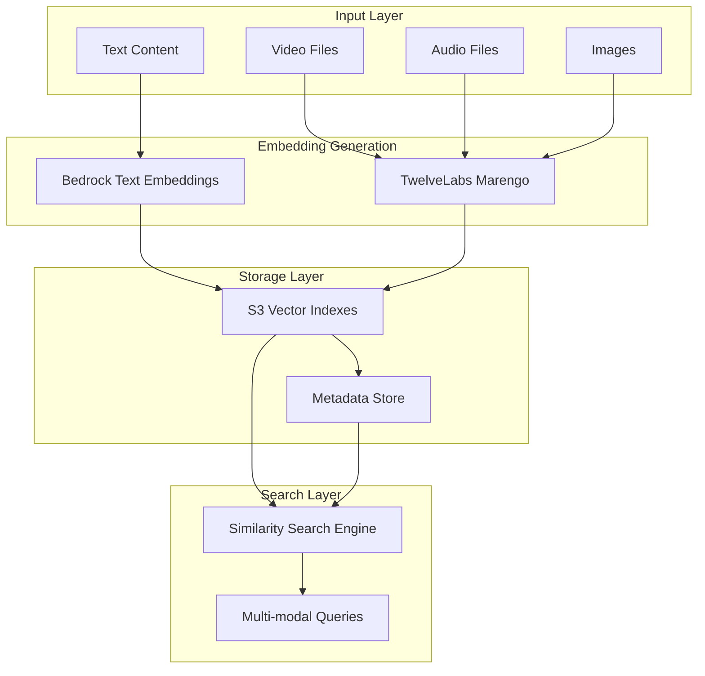

# S3Vector API Documentation

## Overview

S3Vector is a comprehensive vector embedding pipeline that integrates AWS S3 Vectors with Amazon Bedrock and TwelveLabs Marengo for cost-effective, scalable vector storage and similarity search.

## Architecture



## Core Services

### 1. S3VectorStorageManager

Manages S3 vector buckets and indexes with production-ready error handling.

#### Key Methods

```python
class S3VectorStorageManager:
    def create_vector_bucket(self, bucket_name: str, encryption_type: str = "SSE-S3") -> Dict[str, Any]
    def create_vector_index(self, bucket_name: str, index_name: str, dimensions: int) -> str
    def put_vectors_batch(self, index_arn: str, vectors_data: List[Dict[str, Any]]) -> Dict[str, Any]
    def query_similar_vectors(self, index_arn: str, query_vector: List[float], top_k: int = 10) -> Dict[str, Any]
```

#### Usage Example

```python
from src.services.s3_vector_storage import S3VectorStorageManager

# Initialize manager
manager = S3VectorStorageManager()

# Create vector bucket
bucket_response = manager.create_vector_bucket("my-vector-bucket")

# Create index for 1024-dimensional embeddings
index_arn = manager.create_vector_index(
    bucket_name="my-vector-bucket",
    index_name="text-embeddings",
    dimensions=1024
)

# Store vectors with metadata
vectors_data = [
    {
        "key": "doc-1",
        "data": {"float32": [0.1, 0.2, 0.3] * 341 + [0.1]},  # 1024 dimensions
        "metadata": {
            "content_type": "text",
            "category": "documentation",
            "title": "API Guide"
        }
    }
]

storage_result = manager.put_vectors_batch(index_arn, vectors_data)

# Query similar vectors
query_vector = [0.15, 0.25, 0.35] * 341 + [0.15]
results = manager.query_similar_vectors(
    index_arn=index_arn,
    query_vector=query_vector,
    top_k=5
)
```

### 2. BedrockEmbeddingService

Generates text embeddings using Amazon Bedrock foundation models.

#### Supported Models

- **amazon.titan-embed-text-v2:0**: 1024 dimensions, multilingual
- **amazon.titan-embed-image-v1**: 1024 dimensions, multimodal
- **cohere.embed-english-v3**: 1024 dimensions, English optimized
- **cohere.embed-multilingual-v3**: 1024 dimensions, multilingual

#### Usage Example

```python
from src.services.bedrock_embedding import BedrockEmbeddingService

service = BedrockEmbeddingService()

# Generate single embedding
result = service.generate_text_embedding(
    text="Netflix original series about supernatural events",
    model_id="amazon.titan-embed-text-v2:0"
)

print(f"Embedding dimensions: {len(result.embedding)}")
print(f"Processing time: {result.processing_time_ms}ms")

# Batch processing
texts = [
    "Action movie with car chases",
    "Romantic comedy set in Paris", 
    "Documentary about marine life"
]

batch_results = service.batch_generate_embeddings(texts)
```

### 3. TwelveLabsVideoProcessingService

Processes video content using TwelveLabs Marengo model for multimodal embeddings.

#### Key Features

- **Model**: twelvelabs.marengo-embed-2-7-v1:0
- **Input Types**: Video, Text, Audio, Image
- **Output**: 1024-dimensional embeddings
- **Async Processing**: StartAsyncInvoke API
- **Segmentation**: Configurable 2-10 second segments

#### Usage Example

```python
from src.services.twelvelabs_video_processing import TwelveLabsVideoProcessingService

service = TwelveLabsVideoProcessingService()

# Process video asynchronously
job_info = service.start_video_processing(
    video_s3_uri="s3://my-bucket/video.mp4",
    output_s3_uri="s3://my-bucket/embeddings/",
    embedding_options=["visual-text", "audio"],
    use_fixed_length_sec=5.0
)

# Monitor job status
status = service.get_job_status(job_info.job_id)

# Retrieve results when complete
if status.status == "Completed":
    results = service.retrieve_results(job_info.output_s3_uri)
    
    for embedding in results.embeddings:
        print(f"Segment {embedding['startSec']}-{embedding['endSec']}s")
        print(f"Embedding option: {embedding['embeddingOption']}")
        print(f"Dimensions: {len(embedding['embedding'])}")
```

### 4. SimilaritySearchEngine

Orchestrates multimodal similarity searches across different content types.

#### Search Capabilities

- **Text-to-Text**: Semantic text similarity
- **Text-to-Video**: Find video scenes matching text descriptions
- **Video-to-Video**: Find similar video content
- **Cross-Modal**: Search across different media types
- **Temporal**: Time-based video search

#### Usage Example

```python
from src.services.similarity_search_engine import (
    SimilaritySearchEngine, SimilarityQuery, IndexType
)

engine = SimilaritySearchEngine()

# Text query on video index (cross-modal search)
query = SimilarityQuery(
    query_text="car chase scene in urban environment",
    metadata_filters={
        "genre": ["action"],
        "rating": "PG-13"
    },
    temporal_filter={
        "start_sec": 0,
        "end_sec": 300  # First 5 minutes
    }
)

results = engine.find_similar_content(
    query=query,
    index_arn="arn:aws:s3vectors:us-west-2:123456789012:index/videos/action-scenes",
    index_type=IndexType.MARENGO_MULTIMODAL
)

for result in results.results:
    print(f"Video: {result.vector_key}")
    print(f"Similarity: {result.similarity_score:.3f}")
    print(f"Time: {result.temporal_info['start_sec']}-{result.temporal_info['end_sec']}s")
```

## Data Models

### Vector Data Format

All vectors must be stored in S3 Vectors format with float32 precision:

```python
vector_data = {
    "key": "unique-identifier",
    "data": {
        "float32": [0.1, 0.2, 0.3, ...]  # List of float values
    },
    "metadata": {
        "content_type": "text|video|audio|image",
        "model_id": "model-identifier",
        # Additional filterable metadata (max 10 keys)
    }
}
```

### Metadata Schema

#### Text Content Metadata

```python
{
    "content_type": "text",
    "model_id": "amazon.titan-embed-text-v2:0",
    "text_length": 150,
    "embedding_dimensions": 1024,
    "language": "en",
    "category": "documentation",
    "content_id": "doc-123",
    "processing_timestamp": "2024-01-15T10:30:00Z"
}
```

#### Video Content Metadata

```python
{
    "content_type": "video",
    "model_id": "twelvelabs.marengo-embed-2-7-v1:0",
    "start_sec": 120.0,
    "end_sec": 125.0,
    "segment_duration_sec": 5.0,
    "embedding_option": "visual-text",
    "video_duration_sec": 3600.0,
    "video_source_uri": "s3://bucket/video.mp4",
    "title": "Episode 1",
    "series_id": "series-123"
}
```

## Error Handling

### Exception Hierarchy

```python
VectorEmbeddingError (base)
├── ModelAccessError          # Model unavailable/access denied
├── VectorStorageError        # S3 Vectors operation failed
├── AsyncProcessingError      # TwelveLabs processing failed
├── ValidationError           # Input validation failed
├── ConfigurationError        # Invalid configuration
└── OpenSearchIntegrationError # OpenSearch operations failed
```

### Retry Configuration

```python
from src.utils.error_handling import RetryConfig, with_error_handling

# Custom retry configuration
retry_config = RetryConfig(
    max_attempts=5,
    base_delay=2.0,
    max_delay=120.0,
    exponential_base=2.0,
    jitter=True
)

@with_error_handling("my_service", retry_config)
def my_function():
    # Function with automatic retry logic
    pass
```

## Cost Optimization

### Storage Cost Comparison

| Solution | Cost per GB/month | Use Case |
|----------|------------------|----------|
| S3 Vectors | $0.023 | Production workloads |
| Traditional Vector DB | $0.50-$2.00 | High-frequency queries |
| **Savings** | **90%+** | **Most scenarios** |

### Embedding Generation Costs

| Model | Cost per 1K tokens | Best For |
|-------|-------------------|----------|
| Titan Text V2 | $0.0001 | Pure text content |
| Titan Multimodal | $0.0008/image | Mixed content |
| TwelveLabs Marengo | $0.05/minute | Video processing |

### Optimization Strategies

```python
# Optimal batch sizes for cost efficiency
BATCH_SIZES = {
    'text_embedding': 100,      # texts per batch
    'video_processing': 10,     # videos per async job
    'vector_storage': 1000,     # vectors per put operation
}

# Use simulation mode for development
use_real_aws = False  # Defaults to OFF for cost protection
```

## Performance Benchmarks

### Expected Performance

- **Text Embedding**: 100 texts/minute
- **Video Processing**: 1 hour video in 10 minutes
- **Vector Search**: <1 second for 1M+ vectors
- **Concurrent Queries**: 1000+ simultaneous searches

### Monitoring

```python
from src.utils.error_handling import get_system_health

# Get system health status
health = get_system_health()
print(f"Overall status: {health['overall_status']}")

for service, status in health['services'].items():
    print(f"{service}: {status['status']}")
    print(f"  Errors: {status['total_errors']}")
    print(f"  Retry success rate: {status['retry_success_rate']:.1f}%")
```

## Production Deployment

### Environment Configuration

```bash
# Required environment variables
export AWS_REGION=us-west-2
export S3_VECTORS_BUCKET=my-production-vectors
export BEDROCK_TEXT_MODEL=amazon.titan-embed-text-v2:0
export TWELVELABS_MODEL=twelvelabs.marengo-embed-2-7-v1:0

# Optional configuration
export LOG_LEVEL=INFO
export ENABLE_STRUCTURED_LOGGING=true
export CIRCUIT_BREAKER_THRESHOLD=5
export MAX_RETRY_ATTEMPTS=3
```

### IAM Permissions

Required IAM permissions for production deployment:

```json
{
    "Version": "2012-10-17",
    "Statement": [
        {
            "Effect": "Allow",
            "Action": [
                "s3vectors:CreateVectorBucket",
                "s3vectors:CreateVectorIndex",
                "s3vectors:PutVectors",
                "s3vectors:QueryVectors",
                "s3vectors:GetVectors",
                "s3vectors:ListVectors"
            ],
            "Resource": "arn:aws:s3vectors:*:*:*"
        },
        {
            "Effect": "Allow",
            "Action": [
                "bedrock:InvokeModel",
                "bedrock:StartAsyncInvoke",
                "bedrock:GetAsyncInvoke"
            ],
            "Resource": [
                "arn:aws:bedrock:*::foundation-model/amazon.titan-embed-*",
                "arn:aws:bedrock:*::foundation-model/cohere.embed-*",
                "arn:aws:bedrock:*::foundation-model/twelvelabs.marengo-embed-*"
            ]
        },
        {
            "Effect": "Allow",
            "Action": [
                "s3:GetObject",
                "s3:PutObject"
            ],
            "Resource": "arn:aws:s3:::your-bucket/*"
        }
    ]
}
```

### Health Checks

```python
# Health check endpoint for load balancers
def health_check():
    health = get_system_health()
    
    if health['overall_status'] == 'healthy':
        return {"status": "healthy", "timestamp": health['timestamp']}, 200
    else:
        return {"status": "degraded", "services": health['services']}, 503
```

## Examples and Tutorials

### Complete Workflow Example

```python
#!/usr/bin/env python3
"""
Complete S3Vector workflow example demonstrating:
1. Index creation
2. Content ingestion
3. Similarity search
4. Error handling
"""

from src.services.s3_vector_storage import S3VectorStorageManager
from src.services.embedding_storage_integration import EmbeddingStorageIntegration
from src.services.similarity_search_engine import SimilaritySearchEngine, SimilarityQuery, IndexType

def main():
    # Step 1: Initialize services
    storage_manager = S3VectorStorageManager()
    text_storage = EmbeddingStorageIntegration()
    search_engine = SimilaritySearchEngine()
    
    # Step 2: Create infrastructure
    bucket_name = "my-demo-vectors"
    index_name = "demo-text-index"
    
    try:
        # Create bucket and index
        storage_manager.create_vector_bucket(bucket_name)
        index_arn = storage_manager.create_vector_index(
            bucket_name=bucket_name,
            index_name=index_name,
            dimensions=1024
        )
        print(f"Created index: {index_arn}")
        
        # Step 3: Ingest content
        sample_texts = [
            "Netflix original series featuring supernatural mysteries",
            "Documentary about ocean conservation efforts",
            "Comedy show about workplace dynamics"
        ]
        
        for i, text in enumerate(sample_texts):
            result = text_storage.store_text_embedding(
                text=text,
                index_arn=index_arn,
                metadata={
                    "content_id": f"demo-{i+1}",
                    "category": "entertainment" if i == 0 else "documentary" if i == 1 else "comedy"
                },
                vector_key=f"demo-text-{i+1}"
            )
            print(f"Stored: {result.vector_key}")
        
        # Step 4: Search for similar content
        query = SimilarityQuery(
            query_text="TV show with mysterious elements",
            metadata_filters={"category": "entertainment"}
        )
        
        results = search_engine.find_similar_content(
            query=query,
            index_arn=index_arn,
            index_type=IndexType.TITAN_TEXT
        )
        
        print(f"\\nFound {len(results.results)} similar items:")
        for result in results.results:
            print(f"- {result.vector_key}: {result.similarity_score:.3f}")
            print(f"  Category: {result.metadata.get('category')}")
        
    except Exception as e:
        print(f"Error: {e}")
        return 1
    
    return 0

if __name__ == "__main__":
    exit(main())
```

## Support and Troubleshooting

### Common Issues

1. **Model Access Denied**
   - Verify IAM permissions for Bedrock models
   - Check model availability in your region
   - Ensure model access has been requested

2. **Vector Dimension Mismatch**
   - Verify embedding dimensions match index configuration
   - Check model output dimensions (typically 1024)

3. **S3 Vectors Quota Exceeded**
   - Monitor vector storage limits
   - Implement batch processing for large datasets

4. **High Costs**
   - Use simulation mode for development
   - Optimize batch sizes
   - Monitor embedding generation frequency

### Debug Mode

```python
import logging
from src.utils.logging_config import setup_logging

# Enable debug logging
setup_logging(level="DEBUG", structured=True)

# All operations will now include detailed logging
```

For additional support, refer to the AWS S3 Vectors and Amazon Bedrock documentation.